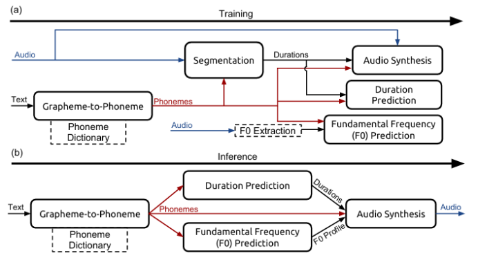
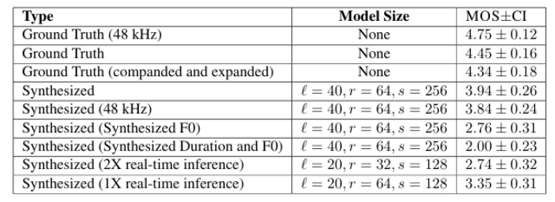
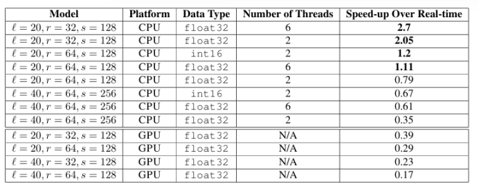
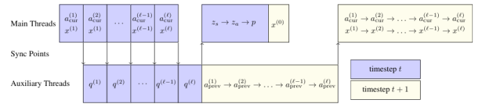

# Deep Voice：实时神经文本转语音

[toc]

## 摘要
>*我们介绍了 Deep Voice，这是一个完全由深度神经网络构建的生产质量的文本转语音系统。Deep Voice 为真正的端到端神经语音合成奠定了基础。该系统由五个主要构建块组成：用于定位音素边界的分割模型、字素到音素转换模型、音素持续时间预测模型、基本频率预测模型和音频合成模型。对于分割模型，我们提出了一种使用连接主义时间分类（CTC）损失的深度神经网络执行音素边界检测的新方法。对于音频合成模型，我们实现了 WaveNet 的一个变体，它需要的参数比原始模型少，训练速度更快。通过为每个组件使用神经网络，我们的系统比传统的文本转语音系统更简单、更灵活，在传统的文本转语音系统中，每个组件都需要费力的特征工程和广泛的领域专业知识。最后，我们展示了使用我们的系统进行推理的速度可以比实时更快，并描述了 CPU 和 GPU 上的优化 WaveNet 推理内核，与现有实现相比，加速高达 400 倍。*

## 1. 引言
&emsp;&emsp;从文本中合成人工人类语音，通常称为文本转语音 （TTS），是许多应用中的重要组成部分，例如语音设备、导航系统和视障人士的可访问性。从根本上说，它允许人机交互，而不需要视觉界面。现代 TTS 系统基于复杂的多阶段处理管道，每个处理管道都可能依赖于手工设计的特征和启发式方法。由于这种复杂性，开发新的 TTS 系统可能非常劳动密集且困难。
&emsp;&emsp;深度语音受到传统文本转语音管道的启发，采用相同的结构，同时用神经网络替换所有组件，并使用更简单的特征：首先我们将文本转换为音素，然后使用音频合成模型将语言特征转换为语音（Taylor，2009）。与以前的工作（使用手工设计的特征，如频谱包络、频谱参数、非周期参数等）不同，我们唯一的功能是带有重音注释、音素持续时间和基频 （F0） 的音素。这种特性选择使我们的系统更容易适用于新的数据集、语音和领域，而无需任何手动数据注释或额外的特征工程。我们通过在一个全新的数据集上重新训练我们的整个管道，而不进行任何超参数更改，该数据集仅包含音频和未对齐的文本转录，并生成相对高质量的语音，从而证明了这一主张。在传统的 TTS 系统中，这种调整需要数天到数周的调整，而 Deep Voice 允许您只需几个小时的手动工作和训练模型所需的时间即可完成此操作。实时推理是生产质量TTS系统的必要条件;没有它，系统将无法用于TTS的大多数应用程序。先前的研究表明，WaveNet（vandenOordetal.， 2016）可以产生接近人类水平的语音。然而，由于模型的高频、自回归特性，WaveNet 推理带来了一个令人生畏的计算问题，并且迄今为止尚不清楚此类模型是否可以在生产系统中使用。我们对这个问题的回答是肯定的，并展示了高效、比实时更快的 WaveNet 推理内核，这些内核可以产生高质量的 16 kHz 音频，并且比以前的 WaveNet 推理实现实现了 400 倍的加速（Paine 等人，2016 年）。

## 2. 相关工作
&emsp;&emsp;以前的工作使用神经网络作为几个TTS系统组件的替代品，包括字形到音素的转换模型（Rao等人，2015;Yao&Zweig，2015），音素持续时间预测模型（Zen&Sak，2015），基本频率预测模型（Pascual&Bonafonte，2016;Ronanki et al.， 2016）和音频合成模型（van den Oord et al.， 2016;Mehri 等人，2016 年）。然而，与Deep Voice不同的是，这些系统都没有解决TTS的全部问题，而且其中许多系统都使用了专门为其领域开发的专门手工设计的功能。
&emsp;&emsp;最近，在参数音频合成方面做了很多工作，特别是 WaveNet、SampleRNN 和 Char2Wav（van den Oord 等人，2016 年;Mehri 等人，2016 年;Sotelo 等人，2017 年）。虽然 WaveNet 可用于有条件和无条件音频生成，但 SampleRNN 仅用于无条件音频生成。Char2Wav 使用基于注意力的音素持续时间模型和等效的 F0 预测模型扩展了 SampleRNN，从而有效地为基于 SampleRNN 的声码器提供本地条件信息。
&emsp;&emsp;Deep Voice 与这些系统的不同之处在于几个关键方面，这些方面显着增加了问题的范围。首先，Deep Voice 是完全独立的;训练新的深度语音系统不需要预先存在的 TTS 系统，并且可以使用短音频剪辑和相应文本转录的数据集从头开始完成。相比之下，复制上述任何一个系统都需要访问和理解预先存在的 TTS 系统，因为它们在训练或推理时使用来自另一个 TTS 系统的特征。
&emsp;&emsp;其次，Deep Voice 最大限度地减少了手工设计功能的使用;它使用独热编码字符进行字素到音素的转换、独热编码的音素和重音、以毫秒为单位的音素持续时间以及可以使用任何 F0 估计算法从波形计算的归一化对数基频。所有这些都可以毫不费力地从音频和成绩单中轻松获得。相比之下，先前的工作使用了更复杂的特征表示，这实际上使得如果没有预先存在的TTS系统，就不可能再现系统。WaveNet 使用 TTS 系统（Zen et al.， 2013）中的几个特征，其中包括单词中的音节数量、短语中音节的位置、音素中当前帧的位置以及语音频谱的动态特征，如频谱和激励参数，以及它们的时间导数。Char2Wav 依赖于 WORLD TTS 系统（Morise 等人，2016 年）的声码器功能来预训练他们的对准模块，包括 F0、频谱包络和非周期参数。
&emsp;&emsp;最后，我们专注于创建一个生产就绪的系统，这要求我们的模型实时运行以进行推理。Deep Voice 可以在几分之一秒内合成音频，并在合成速度和音频质量之间提供可调的权衡。相比之下，以前使用 WaveNet 的结果需要几分钟的运行时间才能合成一秒钟的音频。我们不知道 SampleRNN 有类似的基准测试，但原始出版物中描述的 3 层架构在推理过程中需要的计算量大约是我们最大的 WaveNet 模型的 4-5 倍，因此实时运行模型可能具有挑战性。

## 3. TTS系统组件
如图 1 所示，TTS 系统由五个主要构建块组成：
- **字素到音素模型**从书面文本（英文字符）转换为音素（使用音素字母（如ARPABET编码）。
- **分割模型**在语音数据集中定位音素边界。给定一个音频文件和音频的逐个音素转录，分割模型会识别每个音素在音频中的开始和结束位置。
- **音素持续时间模型**预测音素序列（话语）中每个音素的时间持续时间。
- **基频模型**预测音素是否为浊音。如果是，则模型将预测音素持续时间内的基本频率 （F0）。
- **音频合成模型**结合了字素到音素、音素持续时间和基频预测模型的输出，并以高采样率合成音频，对应于所需的文本。

*图 1.描绘了 （a） 训练过程和 （b） 推理过程的系统图，左侧是输入，右侧是输出。在我们的系统中，持续时间预测模型和 F0 预测模型由使用关节损失训练的单个神经网络执行。字素到音素模型用作音素词典中不存在的单词的回退，例如 CMUDict。虚线表示未学习的组件。*

&emsp;&emsp;在推理过程中，文本通过字素到音素模型或音素字典来生成音素。接下来，将音素作为音素持续时间模型和 F0 预测模型的输入提供，以为每个音素分配持续时间并生成 F0 轮廓。最后，音素、音素持续时间和 F0 被用作音频合成模型的本地条件输入特征，该模型生成最终的话语。
&emsp;&emsp;与其他模型不同，分割模型在推理过程中不使用。相反，它用于使用音素边界注释训练语音数据。音素边界意味着持续时间，可用于训练音素持续时间模型。用音素和音素持续时间以及基频标注的音频用于训练音频合成模型。
&emsp;&emsp;在以下各节中，我们将详细介绍所有构建基块。

### 3.1. 字形到音素模型
&emsp;&emsp;我们的字素到音素模型基于（Yao&Zweig，2015）开发的编码器-解码器架构。然而，我们使用一个多层双向编码器，该编码器具有门控循环单元（GRU）非线性和同样深的单向GRU解码器（Chung等人，2014）。每个解码器层的初始状态被初始化为相应编码器转发层的最终隐藏状态。该架构通过教师强制进行训练，并使用波束搜索进行解码。我们在编码器中使用 3 个双向层，每个层有 1024 个单元，在解码器中使用 3 个相同大小的单向层，并使用宽度为 5 个候选值的波束搜索。在训练过程中，我们在每个循环层之后使用概率为 0.95 的 dropout。
&emsp;&emsp;对于训练，我们使用 Adam 优化算法，其中 $\beta_1=0.9$, $\beta_2=0.999$ , $\varepsilon=10^{-8}$，批次大小为 64，学习率为 $10^{-3}$，退火率为0.85，每 1000 次迭代应用一次 （Kingma & Ba，2014）

### 3.2. 分割模型
&emsp;&emsp;我们的分割模型经过训练，可以输出给定话语和目标音素序列之间的对齐方式。此任务类似于在语音识别中将语音与书面输出对齐的问题。在该领域，联结主义时间分类 （CTC） 损失函数已被证明专注于字符对齐以学习声音和文本之间的映射（Graves 等人，2006 年）。我们从最先进的语音识别系统（Amodei et al.， 2015）中采用卷积递归神经网络架构进行音素边界检测。
&emsp;&emsp;使用CTC训练以生成音素序列的网络将为每个输出音素产生短暂的峰值。虽然这足以使音素与音频大致对齐，但不足以检测精确的音素边界。为了克服这个问题，我们训练预测音素对的序列，而不是单个音素。然后，网络将倾向于在接近一对中两个音素之间边界的时间步长处输出音素对。
&emsp;&emsp;为了说明我们的标签编码，请考虑字符串“Hello！”。要将其转换为音素对标签序列，请将话语转换为音素（使用发音词典（如 CMUDict 或字素到音素模型），并在两端的音素序列与沉默音素填充，以获得“sil HH EH L OWsil”。最后，构造连续的音素对并得到“（sil， HH）， （HH， EH）， （EH， L）， （L， OW）， （OW， sil）”。
&emsp;&emsp;输入音频通过计算 20 个 Mel 频率倒谱系数 （MFCC） 和 10 毫秒的步幅进行特征化。在输入层之上，有两个卷积层（时间和频率的 2D 卷积）、三个双向递归 GRU 层，最后是一个 softmax 输出层。卷积层使用具有单位步幅、高度为 9（在频率箱中）和宽度为 5（在时间中）的内核，循环层使用 512 个 GRU 单元（每个方向）。概率为 0.95 的 Dropout 在最后一个卷积层和递归层之后应用。为了计算音素对错误率（PPER），我们使用波束搜索进行解码。为了解码音素边界，我们执行宽度为 50 的波束搜索，约束相邻音素对至少重叠一个音素，并跟踪每个音素对的话语中的位置。
&emsp;&emsp;对于训练，我们使用 Adam 优化算法，其中 $\beta_1=0.9$, $\beta_2=0.999$ , $\varepsilon=10^{-8}$，批次大小为 128，学习率为 $10^{-4}$，退火率为0.95，每 500 次迭代应用一次 （Kingma & Ba，2014）

### 3.3. 音素持续时间和基频模型
&emsp;&emsp;我们使用单一架构来联合预测音素配比和随时间变化的基频。该模型的输入是一系列带有重音的音素，每个音素和重音都被编码为一个热向量。该架构包括两个全连接层，每个层有 256 个单元，然后是两个单向循环层，每个层有 128 个 GRU 单元，最后是全连接的输出层。概率为 0.8 的 Dropout 在初始全连接层和最后一个循环层之后应用。
&emsp;&emsp;最后一层为每个输入音素生成三个估计值：音素持续时间、音素发声的概率（即具有基频）和 20 个随时间变化的 F0 值，这些值在预测的持续时间内均匀采样。
&emsp;&emsp;该模型通过最小化结合音素持续时间误差、基频误差、音素发声概率的负对数似然以及与 F0 随时间的绝对变化成正比的惩罚项来优化模型，以施加平滑度。损失函数的具体函数形式在附录B中进行了描述。
&emsp;&emsp;对于训练，我们使用 Adam 优化算法，其中 $\beta_1=0.9$, $\beta_2=0.999$ , $\varepsilon=10^{-8}$，批次大小为 128，学习率为 $10^{-4}$，退火率为0.9886，每 400 次迭代应用一次 （Kingma & Ba，2014）

### 3.4. 音频合成模型
&emsp;&emsp;我们的音频合成模型是 WaveNet 的变体。WaveNet 由一个条件网络和一个自回归网络组成，前者将语言特征上采样到所需的频率，后者在离散化音频样本  上生成概率分布 P(y)。我们改变层数、残差通道的数量 r（每层隐藏状态的维度）和跳过通道 s 的数量（层输出在输出层之前投影到的维度）。
&emsp;&emsp;WaveNet 由一个上采样和调理网络组成，然后是 2x1 卷积层，具有 r 残差输出通道和门控 tanh 非线性。我们将卷积分成两个矩阵，每个时间步用  和  相乘。这些层与残差连接相连。每一层的隐藏状态都连接到一个 r 向量，并使用 Wskip 投影到 s 个跳跃通道，然后是两层 1x1 卷积（权重为  和 ），具有 relu 非线性。
&emsp;&emsp;WaveNet 使用转置卷积进行上采样和调节。我们发现，如果我们首先使用一组双向准RNN（QRNN）层对输入进行编码（Bradbury等人，2016），然后通过重复到所需频率来执行上采样，那么我们的模型性能更好，训练速度更快，并且需要的参数更少。
&emsp;&emsp;我们最高质量的最终模型使用 $l= 40$ 层，$r = 64$ 个残余通道，$s = 256$ 个跳过通道。对于训练，我们使用 Adam 优化算法，其中 $\beta_1=0.9$, $\beta_2=0.999$ , $\varepsilon=10^{-8}$，批次大小为 8，学习率为 $10^{-3}$，退火率为0.9886，每 1000 次迭代应用一次 （Kingma & Ba，2014）
&emsp;&emsp;请参阅附录 A，了解我们的 WaveNet 架构和我们使用的 QRNN 层的全部详细信息。

## 4. 结果
&emsp;&emsp;我们在内部英语语音数据库上训练模型，该数据库包含大约 20 小时的语音数据，这些数据被分割成 13,079 个话语。此外，我们还展示了在暴雪 2013 年数据子集上训练的模型的音频合成结果（Prahallad et al.， 2013）。这两个数据集都是由专业的女性演讲者说的。
&emsp;&emsp;我们所有的模型都是使用 TensorFlow 框架实现的（Abadi 等人，2015 年）。

### 4.1. 分割结果
&emsp;&emsp;我们在 8 个 TitanX Maxwell GPU 上进行训练，在 GPU 之间平均分配每批次，并使用在不同 GPU 上计算的平均梯度进行环形全归约，每次迭代大约需要 1300 毫秒。经过大约 14,000 次迭代后，模型收敛到音素对错误率为 7%。我们还发现，音素边界不必精确，随机移动音素边界 10-30 毫秒不会对音频质量产生任何影响，因此怀疑音频质量对超过某个点的音素对错误率不敏感。

### 4.2. 字形到音素结果
&emsp;&emsp;我们根据从CMUDict获得的数据（Weide，2008）训练字素到音素模型。我们去除了所有不以字母开头、包含数字或具有多个发音的单词，从而在原始的 133,854 个字素-音素序列对中留下了 124,978 个。
&emsp;&emsp;我们在单个 TitanX Maxwell GPU 上进行训练，每次迭代大约需要 150 毫秒。经过大约20,000次迭代后，该模型收敛到5.8%的音素错误率和28.7%的单词错误率，这与之前报告的结果相当（Yao&Zweig，2015）。与之前的工作不同，我们在解码过程中不使用语言模型，也不在我们的数据集中包含具有多种发音的单词。

### 4.3. 音素持续时间和基频结果
&emsp;&emsp;我们在单个 TitanX Maxwell GPU 上进行训练，每次迭代大约需要 120 毫秒。经过大约 20,000 次迭代后，模型收敛到平均绝对误差为 38 毫秒（音素持续时间）和 29.4 Hz（基频）。

### 4.4. 音频合成结果
&emsp;&emsp;我们将音频数据集中的话语划分为一秒的块，每个块有四分之一秒的上下文，在开始时用四分之一秒的沉默填充每个话语。我们过滤掉了主要是静音的块，最终得到总共 74,348 个块。
&emsp;&emsp;我们训练了不同深度的模型，包括残差层堆栈中的 10、20、30 和 40 层。我们发现 20 层以下的型号会导致音频质量差。20、30 和 40 层型号均产生高质量的可识别语音，但 40 层型号的噪声比 20 层型号少，可以使用高质量的耳罩式耳机检测到。
&emsp;&emsp;以前的工作强调了接受度在确定模型质量中的重要性。事实上，20 层模型的感受野是 40 层模型的一半。然而，当以 48 kHz 运行时，具有 40 层的型号只有 83 毫秒的感受野，但仍能生成高质量的音频。这表明 20 层模型的感受野是足够的，我们推测音频质量的差异是由感受野大小以外的其他因素造成的。
&emsp;&emsp;我们在 8 个 TitanX Maxwell GPU 上进行训练，每个 GPU 一个块，使用环形 allreduce 来计算在不同 GPU 上计算的平均梯度。每次迭代大约需要 450 毫秒。我们的模型在大约 300,000 次迭代后收敛。我们发现，单个 1.25 秒的块足以使 GPU 上的计算饱和，并且批处理不会提高训练效率。
&emsp;&emsp;与高维生成模型（Theis et al.， 2015）一样，模型损失与单个样本的感知质量在某种程度上无关。虽然具有异常高损耗的模型听起来明显有噪点，但优化到特定阈值以下的模型并没有表明其质量的损失。此外，模型架构的变化（如深度和输出频率）可能会对模型损失产生重大影响，而对音频质量的影响很小。
&emsp;&emsp;为了估计我们 TTS 管道各个阶段的感知质量，我们使用 CrowdMOS 工具包和方法从 Mechanical Turk 众包平均意见得分 （MOS） 评级（评级在 1 到 5 之间，值越高越好）（Ribeiro 等人，2011 年）。为了区分音频预处理的影响、WaveNet模型质量以及音素持续时间和基频模型的质量，我们给出了各种话语类型的MOS分数，包括WaveNet输入（持续时间和F0）从真值音频中提取的合成结果，而不是由其他模型合成的合成结果。结果如表1所示。我们特意在评估者评估的每批样本中都包含真值样本，以突出人类语音的差异，并允许评估者区分模型之间更细粒度的差异;这种方法的缺点是，与仅向评估者展示合成音频样本相比，生成的 MOS 分数将明显降低。
&emsp;&emsp;首先，我们发现，当简单地将音频流从48 kHz降采样到16kHz时，MOS会显着下降，特别是在与定律压缩和量化相结合的情况下，这可能是因为48 kHz的样本作为5分的基线呈现给评分者，而低质量的噪声合成结果显示为1。当与真值持续时间和 F0 一起使用时，我们的模型得分很高，模型的 95% 置信区间与真值样本的置信区间相交。然而，使用合成频率会降低MOS，而进一步包括合成持续时间会显著降低MOS。我们得出的结论是，实现自然TTS的主要障碍在于持续时间和基本频率预测，而我们的系统在这方面并没有实质性地超越最先进的技术水平。最后，我们的最佳模型运行速度略慢于实时模型（见表 2），因此我们证明了可以通过获得运行速度比实时快 1 倍和 2 倍的模型的分数来调整模型大小，从而以合成质量为代价来换取推理速度。
&emsp;&emsp;我们还测试了在原始 WaveNet 出版物的全套特征上训练的 WaveNet 模型，但发现这些模型与在我们的简化特征集上训练的模型之间没有感知差异。

### 4.5. 暴雪（Blizzard）结果
&emsp;&emsp;为了展示我们系统的灵活性，我们在暴雪 2013 数据集（Blizzard 2013 dataset）上用相同的超参数重新训练了我们所有的模型（Prahallad et al.， 2013）。在我们的实验中，我们使用了 20.5 小时的数据集子集，该子集被划分为 9,741 个话语。我们使用第 4.4 节中描述的程序评估了模型，该程序鼓励评估者直接将合成音频与地面实况进行比较。在保留设置中，16 kHz压缩和扩展音频的MOS分数为465 013，而我们的合成音频的MOS分数为267 037。

## 5. 优化推理
&emsp;&emsp;尽管 WaveNet 在生成高质量合成语音方面显示出前景，但最初的实验报告称，短话语的生成时间长达数分钟或数小时。由于模型的高频自回归特性，WaveNet 推理提出了一个极具挑战性的计算问题，这需要比传统递归神经网络多几个数量级的时间步长。生成音频时，必须在大约 60 微秒（对于 16 kHz 音频）或 20 微秒（对于 48 kHz 音频）内生成单个样本。对于我们的 40 层模型，这意味着单层（由多个矩阵乘法和非线性组成）必须在大约 1.5 微秒内完成。相比之下，访问位于 CPU 主内存中的值可能需要 0.1 微秒。为了实时执行推理，我们必须非常小心，永远不要重新计算任何结果，将整个模型存储在处理器缓存中（而不是主内存），并最佳地利用可用的计算单元。这些相同的技术可用于将PixelCNN（Oord等人，2016）的图像合成加速到每张图像的几分之一秒。
&emsp;&emsp;使用我们的 40 层 WaveNet 模型合成一秒钟的音频大约需要  个浮点运算 （FLOP）。任何给定层中的激活都依赖于前一层和前一个时间步长的激活，因此推理必须一次在一个时间步和一层中完成。单层只需要  个 FLOP，这使得实现有意义的 par 等位基因变得困难。除了计算要求外，该模型还有大约  个参数，如果以单一精度表示，则相当于约 6.4 MB。（有关完整的性能模型，请参阅附录 E。
&emsp;&emsp;在 CPU 上，单个 Haswell 或 Broadwell 内核的峰值单精度吞吐量约为 77 109 FLOPsandanL2 到 L1 缓存带宽，约为 140GB/s1。每个时间步必须从缓存中加载一次模型，这需要 100 GB/s 的带宽。即使模型要适应 L2 缓存，实现也需要利用 70% 的最大带宽和 70% 的峰值 FLOPS，以便在单个内核上实时进行推理。将计算拆分到多个内核可以降低问题的难度，但它仍然具有挑战性，因为推理必须在最大内存带宽和峰值 FLOP 的很大一部分上运行，同时保持线程同步。
&emsp;&emsp;GPU 比 CPU 具有更高的内存带宽和峰值 FLOP数，但提供了更专业且因此限制性的计算模型。为每个层或每个时间步启动单个内核的幼稚实现是站不住脚的，但基于持久性 RNN 技术的实现（Diamos 等人，2016 年）可能能够利用 GPU 提供的吞吐量。
&emsp;&emsp;我们为 CPU 和 GPU 实现了高速优化的推理内核，并证明了以比实时更快的速度进行 WaveNet 推理是可以实现的。表 2 列出了不同模型的 CPU 和 GPU 推理速度。在这两种情况下，基准测试都仅包括自回归的高频音频生成，而不包括语言调节特征的生成（可以并行完成整个话语）。对于一部分模型，我们的 CPU 内核以实时或快于实时的速度运行，而 GPU 模型尚不匹配此性能。

*表 1.话语的平均意见分数 （MOS） 和 95% 置信区间 （CI）。此 MOS 分数是通过向评分者在所有模型类型中显示相同的话语而获得的相对 MOS 分数（这鼓励比较评级并允许评分者区分更细粒度的差异）。每批样本还包括地面实况 48 kHz 录音，这使我们所有的评级都与自然人声相当。每个样本收集了 474 个评分。除非另有说明，否则模型使用从真实值中提取的音素持续时间和 F0，而不是由持续时间预测和频率预测模型以及 16384 Hz 音频采样率合成。*

*表 2.float32 和 int16 中不同模型的 CPU 和 GPU 推理内核基准测试。所有 CPU 内核至少使用了一个主线程和一个辅助线程。这些内核对单个语句进行操作，没有批处理。CPU 结果来自主频为 2.6 GHz 的 Intel Xeon E5-2660 v3 Haswell 处理器，GPU 结果来自 GeForce GTX Titan X Maxwell GPU。*

### 5.1. CPU Implementation
&emsp;&emsp;我们通过避免任何重新计算、执行缓存友好的内存访问、通过多线程和高效同步实现并行工作、最小化非线性 FLOP、通过线程固定避免缓存抖动和线程争用，以及使用自定义硬件优化例程进行矩阵乘法和卷积，从而实现实时 CPU 推理。
对于 CPU实现，我们将计算分为以下步骤：
1. **样本嵌入**：通过执行两个样本嵌入来计算 WaveNet 输入因果卷积，一个用于当前时间步长，另一个用于前一个时间步长，并用偏差将它们相加。那是:
$$
\begin{align}
    x^{(0)}=W_{emb,prev} \cdot y_{i-1} + W_{emb,cur} \cdot y_i + B_{embed}
\end{align}
$$

*图 2.两组线程并行运行。  的计算被卸载到辅助线程，而主线程则通过 WaveNetlayers 堆栈进行。当主线程计算输出层时，辅助线程为即将到来的时间步长准备 WaveNet 层的左  半部分卷积。箭头指示一个线程组等待另一个线程组的结果的位置，并作为旋转锁实现。*

2. **层推理**：对于从 $j=1$ 到膨胀宽度 $d$ 的每一层 $j$：
   1. 过矩阵向量乘法计算宽度 2 膨胀卷积的左半部分：
$$
\begin{align}
a^{(j)}_{prev} = W^{(j)}_{prev} \cdot x^{(j-1)}_{i-d}
\end{align}
$$
   2. 计算膨胀卷积的右半部分：
$$
\begin{align}
a^{(j)}_{cur} = W^{(j)}_{cur} \cdot x^{(j-1)}_{i}
\end{align}
$$
   3. 在条件向量 $L_h^{(j)}$ 的情况下计算隐藏状态 $h^{(j)}$：
$$
\begin{align}
a^{(j)} = a^{(j)}_{prev} + a^{(j)}_{cur} + B^{(j)}_h + L^{(j)}_h \\
h^{(j)} = \tanh ( a^{(j)}_{0:r} ) \cdot \sigma (a^{(j)}_{r:2r})
\end{align}
$$
其中 $v_{0:r}$ 表示向量 $v$ 的第一个 r 元素，$v_{r:2r}$ 表示下一个 r 元素。然后，通过矩阵向量乘法计算下一层的输入：
$$
\begin{align}
x^{(j)} = W^{(j)}_{res} \cdot h^{(j)} + B^{(j)}_{res}
\end{align}
$$
   4. 计算当$q^{(0)}=B_{skip}$时，从该层乘以所有层对跳跃通道矩阵的贡献，累加到所有层：
$$
\begin{align}
q^{(j)}=q^{(j-1)} + W^{(j)}_{skip} \cdot h^{(j)}
\end{align}
$$

3. **输出**：计算两个输出 $1\times 1$ 卷积：
$$
\begin{align}
    z_s &= relu(q^{(e)}) \\
    z_a &= relu(W_{relu} \cdot z_s + B_{relu}) \\
    p &= softmax(W_{out} \cdot z_a + B_{out})
\end{align}
$$
最后，从分布p中随机抽取。

&emsp;&emsp;我们在两组线程中并行化它们，如图 2 所示。一组主线程计算 $x^{(0)}$、$a_{cur}^{(j)}$、 $h^{(j)}$和 $x^{(j)}$、$z_a$ 和 $p$。一组辅助线程计算 $a^{(j)}_{prev}$、$q^{(j)}$和 $z$，其中 $a^{(j)}_{prev}$ 为下一个即将到来的时间步长计算，而主线程计算 $z_a$ 和 $p$。这些组中的每一个都可以由单个线程或多个线程组成;如果有多个线程，则每个线程计算每个矩阵向量乘法、二元运算或一元运算的一个块，并根据需要插入线程屏障。将模型拆分到多个线程之间既可以拆分计算，也可以用于确保模型权重适合处理器 L2 缓存。
&emsp;&emsp;将线程固定到物理内核（或禁用超线程）对于避免线程争用和缓存抖动非常重要，并且可以将性能提高约 30%。
&emsp;&emsp;根据模型大小的不同，非线性（$tanh$、$sigmoid$ 和 $softmax$）也可能占用相当大的推理时间，因此将所有非线性都置于高精度近似中，这在附录 C 中有详细说明。这些近似产生的最大绝对误差为 $tanh$ 为 $15\times 10^3$，$sigmoid$ 为 $25\times 10^3$，$e^x$ 为 $24\times 10^5$。使用近似非线性而不是精确非线性，性能可提高约 30%。
&emsp;&emsp;我们还使用量化为 int16 的权重矩阵来实现推理，并且在使用量化时发现感知质量没有变化。对于较大的模型，当使用较少的线程时，量化可以显著提高速度，但线程同步的开销使其无法用于处理大量线程。
&emsp;&emsp;最后，我们使用PeachPy（Dukhan，2015）专门针对我们的矩阵大小编写用于矩阵向量乘法的自定义AVX汇编内核。使用 float32 时，使用我们的自定义汇编内核进行推理的速度比 Intel MKL 快 1.5 倍，比 OpenBLAS 快 3.5 倍。这两个库都不提供等效的 int16 操作。

### 5.2. GPU 实现
&emsp;&emsp;由于其计算强度，许多神经模型最终都部署在 GPU 上，而 GPU 的计算吞吐量比 CPU 高得多。由于我们的模型受内存带宽限制和 FLOP，因此在 GPU 上运行推理似乎是一个自然的选择，但事实证明，这会带来一系列不同的挑战。
&emsp;&emsp;通常，代码在 GPU 上以一系列内核调用运行，每个矩阵乘法或向量运算都是其自己的内核。但是，对于这样的方法，CUDA 内核启动的延迟（可能长达 50 秒）与从 GPU 内存加载整个模型所需的时间相结合，非常大。这种风格的推理内核最终比实时慢大约 1000 倍。
&emsp;&emsp;为了在 GPU 上接近实时，我们改用持久性 RNN 技术构建了一个内核（Diamos et al.， 2016），该技术在单个内核启动中生成输出音频中的所有样本。模型的权重被加载到寄存器中一次，然后在整个推理过程中不卸载它们而使用。由于 CUDA 编程模型与此类持久内核之间的不匹配，因此生成的内核专门针对特定模型大小，并且编写起来非常耗费人力。尽管我们的 GPU 推理速度不是完全实时的（表 2），但我们相信，借助这些技术和更好的实现，我们可以在 GPU 和 CPU 上实现实时 WaveNet 推理。附录 D 中提供了持久性 GPU 内核的实现详细信息。

## 6. 结论
&emsp;&emsp;在这项工作中，我们证明了当前的深度学习方法通过构建一个完全神经系统，对于高质量文本转语音引擎的所有组件都是可行的。我们将推理优化为比实时更快的速度，表明这些技术可以应用于以流式方式实时生成音频。我们的系统可以在没有任何人工参与的情况下进行训练，大大简化了创建 TTS 系统的过程。
&emsp;&emsp;我们的工作为探索开辟了许多新的可能方向。通过仔细优化、GPU 上的模型量化和 CPU 上的 int8 量化，以及试验其他架构（如 Xeon Phi），可以进一步提高推理性能。另一个自然的方向是消除阶段之间的分离，并将分割、持续时间预测和基频预测模型直接合并到音频合成模型中，从而将问题转化为完整的序列到序列模型，创建一个单一的端到端可训练的TTS系统，并允许我们在没有中间监督的情况下训练整个系统。通过更大的训练数据集或生成建模技术改进持续时间和频率模型，而不是融合模型，可能会对语音的自然度产生影响。

## 引用
&emsp;&emsp;。。。

