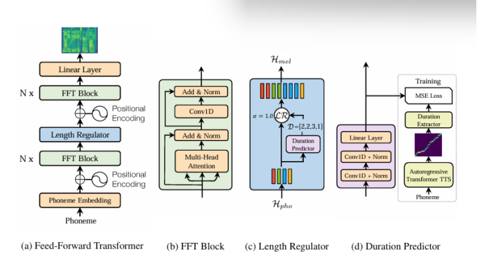

# FastSpeech：快速、强大且可控的文本转语音
## 摘要
>*基于神经网络的端到端文本转语音 （TTS） 显著提高了合成语音的质量。突出的方法（例如，Tacotron 2）通常从文本生成 mel-spectrogram，然后使用声码器（如 WaveNet）从 mel-spectrogram 合成语音。与传统的串联和统计参数方法相比，基于神经网络的端到端模型存在推理速度慢、合成语音通常不鲁棒（即跳过或重复一些单词）和缺乏可理解性（语音速度或韵律控制）的问题。在这项工作中，我们提出了一种基于Transformer的前馈网络，用于在TTS的paral lel中生成mel-spectrogram。具体来说，我们从基于编码器-解码器的教师模型中提取注意力对齐，用于音素持续时间预测，长度调节器使用该模型来扩展源音素序列以匹配目标 mel-频谱图序列的长度，以生成并行 mel-频谱图。在 LJSpeech 数据集上的实验表明，我们的并行模型在语音质量方面与自回归模型匹配，几乎消除了在特别困难的情况下单词跳跃和重复的问题，并且可以平滑地调整语速。最重要的是，与自回归 Transformer TTS 相比，我们的模型将梅尔频谱图生成速度提高了 270 倍，端到端语音合成速度提高了 38 倍。因此，我们将我们的模型称为 FastSpeech。*

## 1 引言
&emsp;&emsp;近年来，由于深度学习的进步，文本转语音（TTS）引起了广泛关注。基于深度神经网络的系统在TTS中越来越受欢迎，如Tacotron [27]、Tacotron 2 [22]、Deep Voice 3 [19]和完全端到端的ClariNet [18]。这些模型通常首先从文本输入自回归生成梅尔频谱图，然后使用声码器（如Griffin-Lim [6]、WaveNet [24]、Parallel WaveNet [16]或WaveGlow [20]4）从梅尔频谱图合成语音。基于神经网络的TTS在语音质量方面优于传统的串联和统计参数方法[9,28]。
&emsp;&emsp;在当前基于神经网络的 TTS 系统中，mel-spectrogram 是自回归生成的。由于梅尔频谱图的长序列和自回归性质，这些系统面临着几个挑战：
- 梅尔谱图生成的推理速度较慢。尽管基于CNN和Transformer的TTS[14,19]可以比基于RNN的模型[22]更快地进行训练，但鉴于Mel-Specrogram序列的长度通常为数百或数千个，所有模型都会生成基于先前生成的Mel-Spectrogram的Mel-Specrogram，并且推理速度较慢。
- 合成语音通常不鲁棒。由于自回归生成过程中存在错误传播[3]和文本和语音之间的错误注意力对齐，因此生成的梅尔频谱图通常存在单词跳跃和重复的问题[19]。
- 合成语音缺乏可控性。以前的自回归模型会自动逐个生成梅尔频谱图，而无需明确利用文本和语音之间的对齐方式。因此，在自回归生成中，通常很难直接控制语音速度和韵律。
&emsp;&emsp;考虑到文本和语音之间的单调对齐，为了加快梅尔频谱图的生成，在这项工作中，我们提出了一种新的模型FastSpeech，该模型将文本（音素）序列作为输入，并以非自回归的方式生成梅尔频谱图。它采用基于Transformer中的自注意力[25]和一维卷积[5,11,19]的前馈网络。由于 mel-spectrogram 序列比其对应的音素序列长得多，为了解决两个序列之间的长度不匹配问题，FastSpeech 采用了一个长度调节器，该调节器根据音素持续时间（即每个音素对应的 mel-频谱图数量）对音素序列进行上采样，以匹配 mel-spectrogram 序列的长度。调节器建立在音素持续时间预测器之上，该预测器预测每个音素的持续时间。
&emsp;&emsp;我们提出的 FastSpeech 可以解决上述三个挑战，具体如下：
- 通过并行梅尔频谱图生成，FastSpeech 大大加快了合成过程。
- 音素持续时间预测器确保音素与其梅尔频谱图之间的硬对齐，这与自回归模型中的软注意力和自动注意力对齐非常不同。因此，FastSpeech 避免了错误传播和错误的注意力对齐问题，从而降低了跳过单词和重复单词的比例。
- 长度调节器可以通过延长或缩短音素持续时间来轻松调整语速，以确定生成的梅尔频谱图的长度，还可以通过在相邻音素之间添加中断来控制部分韵律。
&emsp;&emsp;我们在 LJSpeech 数据集上进行实验来测试 FastSpeech。结果表明，在语音质量方面，FastSpeech与自回归Transformer模型几乎匹配。此外，与自回归 Transformer TTS 模型相比，FastSpeech 在 mel-spectrogram 生成上实现了 270 倍的加速，在最终语音合成上实现了 38 倍的加速，几乎消除了单词跳过和重复的问题，并且可以平滑调整语音速度。我们将我们的方法生成的一些音频文件附在补充材料中。

## 2 背景
&emsp;&emsp;在本节中，我们简要概述了这项工作的背景，包括文本到语音、序列到序列学习和非自回归序列生成。
&emsp;&emsp;**Text to Speech**  TTS[1， 18， 21， 22， 27]旨在合成自然且可理解的语音给定文本，长期以来一直是人工智能领域的研究热点。TTS的研究已经从早期的串联合成[9]、统计参数合成[13,28]转向基于神经网络的参数合成[1]和端到端模型[14,18,22,27]，端到端模型的合成语音质量接近达到人类水平。基于神经网络的端到端 TTS 模型通常首先将文本转换为声学特征（例如，mel 频谱图），然后将 mel 频谱图转换为音频样本。然而，大多数神经 TTS 系统以自回归方式生成梅尔频谱图，这受到推理速度慢的影响，合成语音通常缺乏鲁棒性（单词跳过和重复）和可控性（语音速度或韵律控制）。在这项工作中，我们提出了FastSpeech以非自回归方式生成mel-频谱图，足以处理上述问题。
&emsp;&emsp;**Sequence to Sequence Learning**  序列到序列学习[2， 4， 25]通常建立在编码器-解码器框架之上：编码器将源序列作为输入并生成一组表示。之后，解码器根据源表示及其先前元素估计每个目标元素的条件概率。在编码器和解码器之间进一步引入了注意力机制[2]，以便在预测当前元素时找到需要关注的源表示，是序列到序列学习的重要组成部分。
&emsp;&emsp;在这项工作中，我们提出了一种前馈网络来并行生成序列，而不是使用传统的编码器-注意力-解码器框架进行序列到序列的学习。
&emsp;&emsp;**Non-Autoregressive Sequence Generation（非自回归序列生成）**   与自回归序列生成不同，非自回归模型并行生成序列，而不显式依赖于前面的元素，这可以大大加快推理过程。非自回归生成已经在一些序列生成任务中进行了研究，如神经机器翻译[7,8,26]和音频合成[16,18,20]。我们的FastSpeech与上述工作在两个方面有所不同：1）以往的工作在神经机器翻译或音频合成中采用非自回归生成，主要是为了推理加速，而FastSpeech则侧重于推理加速和提高TTS中合成语音的鲁棒性和可控性。2）对于TTS，虽然Parallel WaveNet [16]、ClariNet [18]和WaveGlow [20]并行生成音频，但它们受制于mel-频谱图，而mel-频谱图仍然是自回归生成的。因此，它们没有解决这项工作中考虑的挑战。有一个并发的工作[17]也并行生成梅尔频谱图。然而，它仍然采用了具有注意力机制的编码器-解码器框架，该框架1）与教师模型相比需要2个3x模型参数，因此实现的推理加速比FastSpeech慢;2）无法完全解决单词跳过和重复的问题，而FastSpeech几乎消除了这些问题。

## 3 FastSpeech
&emsp;&emsp;在本节中，我们将介绍FastSpeech的架构设计。为了并行生成目标梅尔频谱图序列，我们设计了一种新颖的前馈结构，而不是使用大多数基于序列到序列的自回归[14， 22， 25]和非自回归[7， 8， 26]生成的基于编码器-注意力-解码器的架构。FastSpeech 的整体模型架构如图 1 所示。我们将在以下小节中详细介绍这些组件。

### 3.1 前馈变压器
&emsp;&emsp;FastSpeech的架构是基于Transformer中的自注意力[25]和1D卷积[5,19]的前馈结构。我们将这种结构称为前馈转换器 （FFT），如图 1a 所示。 Feed-Forward Transformer 堆叠多个 FFT 模块，用于音素到梅尔频谱图的转换，N 个模块位于音素侧，N 个模块位于梅尔频谱图侧，中间有一个长度调节器（将在下一小节中描述），以弥合音素和梅尔频谱图序列之间的长度差距。每个 FFT 模块都由一个自注意力和一维卷积网络组成，如图 1b 所示。自注意力网络由一个多头注意力组成，用于提取交叉位置信息。与 Transformer 中的 2 层密集网络不同，我们使用带有 ReLU 激活的 2 层 1D 卷积网络。其动机是，在语音任务中，相邻的隐藏状态在字符/音素和梅尔频谱图序列中更密切相关。我们在实验部分评估了一维卷积网络的有效性。在Transformer[25]之后，分别在自注意力网络和一维卷积网络之后加入残差连接、层归一化和丢点。

*图1：FastSpeech 的整体体系结构。（a）. 前馈变压器。（b）.前馈变压器模块。（c）.长度调节器。持续时间预测器。MSE 损失表示预测持续时间和提取持续时间之间的损失，该损失仅存在于训练过程中。*

### 3.2 长度调节器
&emsp;&emsp;
&emsp;&emsp;
&emsp;&emsp;
&emsp;&emsp;
&emsp;&emsp;
&emsp;&emsp;
&emsp;&emsp;
&emsp;&emsp;
&emsp;&emsp;
&emsp;&emsp;
&emsp;&emsp;
&emsp;&emsp;
&emsp;&emsp;
&emsp;&emsp;
&emsp;&emsp;
&emsp;&emsp;
&emsp;&emsp;
&emsp;&emsp;
&emsp;&emsp;
&emsp;&emsp;
&emsp;&emsp;
&emsp;&emsp;
&emsp;&emsp;
&emsp;&emsp;
&emsp;&emsp;
&emsp;&emsp;
&emsp;&emsp;
&emsp;&emsp;
&emsp;&emsp;
&emsp;&emsp;
&emsp;&emsp;
&emsp;&emsp;
&emsp;&emsp;
&emsp;&emsp;
&emsp;&emsp;
&emsp;&emsp;
&emsp;&emsp;
&emsp;&emsp;
&emsp;&emsp;
&emsp;&emsp;
&emsp;&emsp;
&emsp;&emsp;
&emsp;&emsp;
&emsp;&emsp;
&emsp;&emsp;
&emsp;&emsp;
&emsp;&emsp;
&emsp;&emsp;
&emsp;&emsp;
&emsp;&emsp;
&emsp;&emsp;
&emsp;&emsp;
&emsp;&emsp;
&emsp;&emsp;
&emsp;&emsp;
&emsp;&emsp;
&emsp;&emsp;
&emsp;&emsp;
&emsp;&emsp;
&emsp;&emsp;
&emsp;&emsp;
&emsp;&emsp;
&emsp;&emsp;
&emsp;&emsp;
&emsp;&emsp;
&emsp;&emsp;
&emsp;&emsp;
&emsp;&emsp;
&emsp;&emsp;
&emsp;&emsp;
&emsp;&emsp;
&emsp;&emsp;
&emsp;&emsp;
&emsp;&emsp;
&emsp;&emsp;
&emsp;&emsp;
&emsp;&emsp;
&emsp;&emsp;
&emsp;&emsp;
