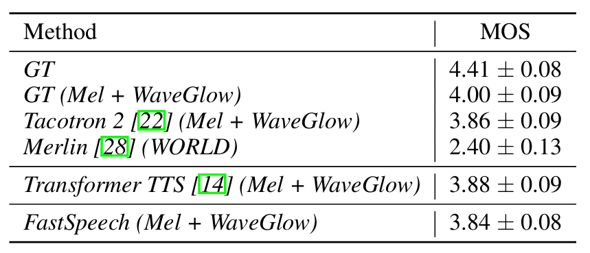
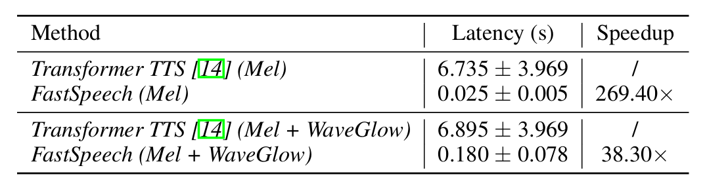
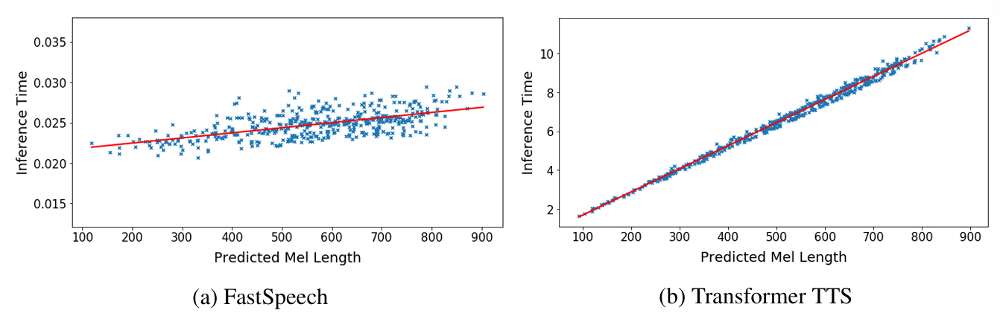
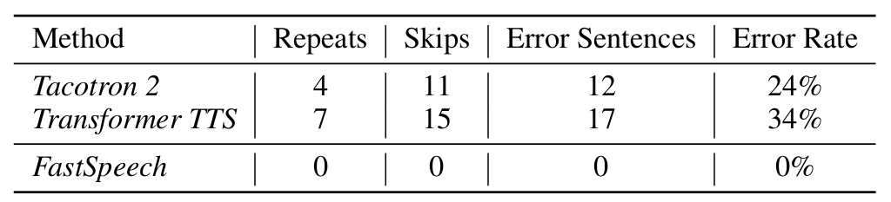
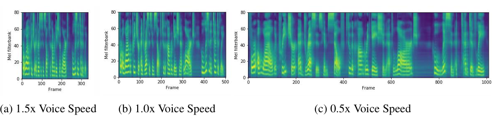
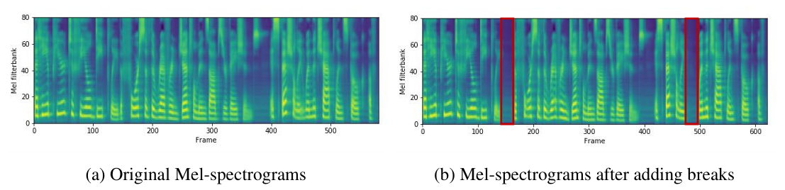
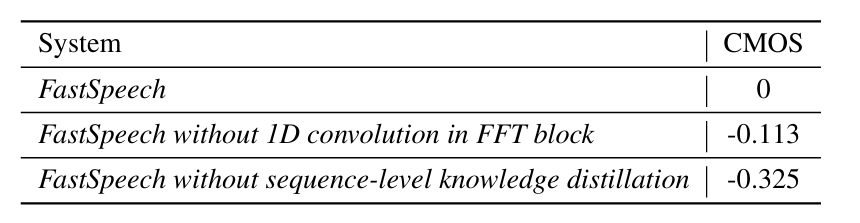

# FastSpeech：快速、强大且可控的文本转语音
## 摘要
>*基于神经网络的端到端文本转语音 （TTS） 显著提高了合成语音的质量。突出的方法（例如，Tacotron 2）通常从文本生成 mel-spectrogram，然后使用声码器（如 WaveNet）从 mel-spectrogram 合成语音。与传统的串联和统计参数方法相比，基于神经网络的端到端模型存在推理速度慢、合成语音通常不鲁棒（即跳过或重复一些单词）和缺乏可理解性（语音速度或韵律控制）的问题。在这项工作中，我们提出了一种基于Transformer的前馈网络，用于在TTS的paral lel中生成mel-spectrogram。具体来说，我们从基于编码器-解码器的教师模型中提取注意力对齐，用于音素持续时间预测，长度调节器使用该模型来扩展源音素序列以匹配目标 mel-频谱图序列的长度，以生成并行 mel-频谱图。在 LJSpeech 数据集上的实验表明，我们的并行模型在语音质量方面与自回归模型匹配，几乎消除了在特别困难的情况下单词跳跃和重复的问题，并且可以平滑地调整语速。最重要的是，与自回归 Transformer TTS 相比，我们的模型将梅尔频谱图生成速度提高了 270 倍，端到端语音合成速度提高了 38 倍。因此，我们将我们的模型称为 FastSpeech。*

## 1 引言
&emsp;&emsp;近年来，由于深度学习的进步，文本转语音（TTS）引起了广泛关注。基于深度神经网络的系统在TTS中越来越受欢迎，如Tacotron [27]、Tacotron 2 [22]、Deep Voice 3 [19]和完全端到端的ClariNet [18]。这些模型通常首先从文本输入自回归生成梅尔频谱图，然后使用声码器（如Griffin-Lim [6]、WaveNet [24]、Parallel WaveNet [16]或WaveGlow [20]4）从梅尔频谱图合成语音。基于神经网络的TTS在语音质量方面优于传统的串联和统计参数方法[9,28]。
&emsp;&emsp;在当前基于神经网络的 TTS 系统中，mel-spectrogram 是自回归生成的。由于梅尔频谱图的长序列和自回归性质，这些系统面临着几个挑战：
- 梅尔谱图生成的推理速度较慢。尽管基于CNN和Transformer的TTS[14,19]可以比基于RNN的模型[22]更快地进行训练，但鉴于Mel-Specrogram序列的长度通常为数百或数千个，所有模型都会生成基于先前生成的Mel-Spectrogram的Mel-Specrogram，并且推理速度较慢。
- 合成语音通常不鲁棒。由于自回归生成过程中存在错误传播[3]和文本和语音之间的错误注意力对齐，因此生成的梅尔频谱图通常存在单词跳跃和重复的问题[19]。
- 合成语音缺乏可控性。以前的自回归模型会自动逐个生成梅尔频谱图，而无需明确利用文本和语音之间的对齐方式。因此，在自回归生成中，通常很难直接控制语音速度和韵律。
&emsp;&emsp;考虑到文本和语音之间的单调对齐，为了加快梅尔频谱图的生成，在这项工作中，我们提出了一种新的模型FastSpeech，该模型将文本（音素）序列作为输入，并以非自回归的方式生成梅尔频谱图。它采用基于Transformer中的自注意力[25]和一维卷积[5,11,19]的前馈网络。由于 mel-spectrogram 序列比其对应的音素序列长得多，为了解决两个序列之间的长度不匹配问题，FastSpeech 采用了一个长度调节器，该调节器根据音素持续时间（即每个音素对应的 mel-频谱图数量）对音素序列进行上采样，以匹配 mel-spectrogram 序列的长度。调节器建立在音素持续时间预测器之上，该预测器预测每个音素的持续时间。
&emsp;&emsp;我们提出的 FastSpeech 可以解决上述三个挑战，具体如下：
- 通过并行梅尔频谱图生成，FastSpeech 大大加快了合成过程。
- 音素持续时间预测器确保音素与其梅尔频谱图之间的硬对齐，这与自回归模型中的软注意力和自动注意力对齐非常不同。因此，FastSpeech 避免了错误传播和错误的注意力对齐问题，从而降低了跳过单词和重复单词的比例。
- 长度调节器可以通过延长或缩短音素持续时间来轻松调整语速，以确定生成的梅尔频谱图的长度，还可以通过在相邻音素之间添加中断来控制部分韵律。
&emsp;&emsp;我们在 LJSpeech 数据集上进行实验来测试 FastSpeech。结果表明，在语音质量方面，FastSpeech与自回归Transformer模型几乎匹配。此外，与自回归 Transformer TTS 模型相比，FastSpeech 在 mel-spectrogram 生成上实现了 270 倍的加速，在最终语音合成上实现了 38 倍的加速，几乎消除了单词跳过和重复的问题，并且可以平滑调整语音速度。我们将我们的方法生成的一些音频文件附在补充材料中。

## 2 背景
&emsp;&emsp;在本节中，我们简要概述了这项工作的背景，包括文本到语音、序列到序列学习和非自回归序列生成。
&emsp;&emsp;**Text to Speech**  TTS[1， 18， 21， 22， 27]旨在合成自然且可理解的语音给定文本，长期以来一直是人工智能领域的研究热点。TTS的研究已经从早期的串联合成[9]、统计参数合成[13,28]转向基于神经网络的参数合成[1]和端到端模型[14,18,22,27]，端到端模型的合成语音质量接近达到人类水平。基于神经网络的端到端 TTS 模型通常首先将文本转换为声学特征（例如，mel 频谱图），然后将 mel 频谱图转换为音频样本。然而，大多数神经 TTS 系统以自回归方式生成梅尔频谱图，这受到推理速度慢的影响，合成语音通常缺乏鲁棒性（单词跳过和重复）和可控性（语音速度或韵律控制）。在这项工作中，我们提出了FastSpeech以非自回归方式生成mel-频谱图，足以处理上述问题。
&emsp;&emsp;**Sequence to Sequence Learning**  序列到序列学习[2， 4， 25]通常建立在编码器-解码器框架之上：编码器将源序列作为输入并生成一组表示。之后，解码器根据源表示及其先前元素估计每个目标元素的条件概率。在编码器和解码器之间进一步引入了注意力机制[2]，以便在预测当前元素时找到需要关注的源表示，是序列到序列学习的重要组成部分。
&emsp;&emsp;在这项工作中，我们提出了一种前馈网络来并行生成序列，而不是使用传统的编码器-注意力-解码器框架进行序列到序列的学习。
&emsp;&emsp;**Non-Autoregressive Sequence Generation（非自回归序列生成）**   与自回归序列生成不同，非自回归模型并行生成序列，而不显式依赖于前面的元素，这可以大大加快推理过程。非自回归生成已经在一些序列生成任务中进行了研究，如神经机器翻译[7,8,26]和音频合成[16,18,20]。我们的FastSpeech与上述工作在两个方面有所不同：1）以往的工作在神经机器翻译或音频合成中采用非自回归生成，主要是为了推理加速，而FastSpeech则侧重于推理加速和提高TTS中合成语音的鲁棒性和可控性。2）对于TTS，虽然Parallel WaveNet [16]、ClariNet [18]和WaveGlow [20]并行生成音频，但它们受制于mel-频谱图，而mel-频谱图仍然是自回归生成的。因此，它们没有解决这项工作中考虑的挑战。有一个并发的工作[17]也并行生成梅尔频谱图。然而，它仍然采用了具有注意力机制的编码器-解码器框架，该框架1）与教师模型相比需要2个3x模型参数，因此实现的推理加速比FastSpeech慢;2）无法完全解决单词跳过和重复的问题，而FastSpeech几乎消除了这些问题。

## 3 FastSpeech
&emsp;&emsp;在本节中，我们将介绍FastSpeech的架构设计。为了并行生成目标梅尔频谱图序列，我们设计了一种新颖的前馈结构，而不是使用大多数基于序列到序列的自回归[14， 22， 25]和非自回归[7， 8， 26]生成的基于编码器-注意力-解码器的架构。FastSpeech 的整体模型架构如图 1 所示。我们将在以下小节中详细介绍这些组件。

### 3.1 前馈变压器
&emsp;&emsp;FastSpeech的架构是基于Transformer中的自注意力[25]和1D卷积[5,19]的前馈结构。我们将这种结构称为前馈转换器 （FFT），如图 1a 所示。 Feed-Forward Transformer 堆叠多个 FFT 模块，用于音素到梅尔频谱图的转换，N 个模块位于音素侧，N 个模块位于梅尔频谱图侧，中间有一个长度调节器（将在下一小节中描述），以弥合音素和梅尔频谱图序列之间的长度差距。每个 FFT 模块都由一个自注意力和一维卷积网络组成，如图 1b 所示。自注意力网络由一个多头注意力组成，用于提取交叉位置信息。与 Transformer 中的 2 层密集网络不同，我们使用带有 ReLU 激活的 2 层 1D 卷积网络。其动机是，在语音任务中，相邻的隐藏状态在字符/音素和梅尔频谱图序列中更密切相关。我们在实验部分评估了一维卷积网络的有效性。在Transformer[25]之后，分别在自注意力网络和一维卷积网络之后加入残差连接、层归一化和丢点。

*图1：FastSpeech 的整体体系结构。（a）. 前馈变压器。（b）.前馈变压器模块。（c）.长度调节器。持续时间预测器。MSE 损失表示预测持续时间和提取持续时间之间的损失，该损失仅存在于训练过程中。*

### 3.2 长度调节器
&emsp;&emsp;长度调节器（图1c）用于解决前馈变压器中音素和频谱图序列之间的长度不匹配问题，以及控制语速和韵律的一部分。音素序列的长度通常小于其 mel-spectrogram 序列的长度，并且每个音素对应于几个 mel-spectrogram。我们将对应于音素的 mel 频谱图的长度称为音素持续时间（我们将在下一小节中描述如何预测音素持续时间）。基于音素持续时间 $d$，长度调节器将音素序列的隐藏状态扩展 $d$ 次，然后隐藏状态的总长度等于 mel-频谱图的长度。将音素序列的隐藏状态表示为 $\mathcal{H}_{pho} = [h_1, h_2,\dots, h_n]$，其中 n 是序列的长度。将音素持续时间序列表示为 $\mathcal{D} = [d_1, d_2,\dots, d_n]$，其中 $\sum^n_{i=1}d_i = m$，$m$ 是 mel-频谱图序列的长度。我们将长度调节器 LR 表示为：
$$
\begin{align}
    \mathcal{H}_{mel}=\mathcal{L}\mathcal{R}(\mathcal{H_{pho}},\mathcal{D},\alpha)
\end{align}
$$
&emsp;&emsp;其中$\alpha$是一个超参数，用于确定扩展序列 $\mathcal{H}_{mel}$ 的长度，从而控制语音速度。例如，给定 $\mathcal{H}_{pho} = [h_1, h_2, h_3, h_4]$ 和相应的音素持续时间序列 $\mathcal{D} = [2,2,3,1]$，如果$\alpha = 1$（正常速度），则基于公式 1 的扩展序列 $\mathcal{H}_{mel}$ 变为 $[h_1, h_1, h_2, h_2, h_2, h_3, h_3, h_3, h_4]$ 。当 $\alpha = 1.3$（慢速）和 $0.5$（快速）时，持续时间序列分别变为 $\mathcal{D}_{\alpha=1.3} = [2.6,2.6,3.9,1.3] \approx [3,3,4,1]$ 和 $\mathcal{D}_{\alpha=0.5} = [1,1,1.5,0.5] \approx [1,1,2,1]$，扩展序列变为 $[h_1, h_1, h_1, h_2, h_2, h_3, h_3, h_3, h_3, h_4]$ 和 $[h_1, h_2, h_3, h_3, h_4]$。我们还可以通过调整句子中空格字符的持续时间来控制单词之间的中断，从而调整合成语音的部分韵律

### 3.3 持续时间预测器
&emsp;&emsp;音素持续时间预测对于长度调节器很重要。如图 1d 所示，持续时间预测器由一个具有 ReLU 激活功能的 2 层 1D 卷积网络组成，每个卷积网络后面跟着层归一化和丢弃层，以及一个用于输出标量的额外线性层，标量恰好是预测的音素持续时间。请注意，此模块堆叠在音素侧的 FFT 模块之上，并与 FastSpeech 模型联合训练，以预测每个音素的梅尔频谱图长度以及均方误差 （MSE） 损失。我们预测了对数域的长度，这使得它们更高斯并且更容易训练。请注意，训练的持续时间预测器仅在 TTS 推理阶段使用，因为我们可以在训练中直接使用从自回归教师模型中提取的音素持续时间（请参阅以下讨论）。
&emsp;&emsp;为了训练持续时间预测器，我们从自回归教师 TTS 模型中提取真值音素持续时间，如图 1d 所示。详细步骤如下：
- 我们首先根据[14]训练一个基于自回归编码器-注意力-解码器的Transformer TTS模型。
&emsp;&emsp;对于每个训练序列对，我们从经过训练的教师模型中提取解码器到编码器的注意力对齐。由于多头自注意力[25]，存在多次注意力对齐，并非所有注意力头都表现出对角线特性（音素和梅尔-频谱图序列是单调对齐的）。我们提出了一个焦点率 $F$ 来衡量注意力头如何接近对角线：$F = \frac{1}{S}\sum^S_{s=1} max_{1<t<T} a_{s,t}$，其中 $S$ 和 $T$ 是真值谱图和音素的长度，$a_{s,t}$ 表示注意力矩阵的第 $s$ 行和第 $t$ 列中的元素。我们计算每个头部的聚焦率，并选择具有最大 $F$ 的头部作为注意力对齐。
&emsp;&emsp;最后，我们根据持续时间提取器$d_i = \sum^S_{s=1}[\arg\max_t a_{s,t} = i]$提取音素持续时间序列$D = [d_1, d_2,\dots, d_n]$。也就是说，音素的持续时间是根据在上述步骤中选择的注意力头参加的梅尔频谱图的数量。

## 4 实验装置
### 4.1 数据集
&emsp;&emsp;我们在LJSpeech数据集[10]上进行了实验，该数据集包含13,100个英文音频片段和相应的文本转录，总音频长度约为24小时。我们将数据集随机分为 3 组：12500 个样本用于训练，300 个样本用于验证，300 个样本用于测试。为了缓解发音错误的问题，我们使用内部字素到音素转换工具[23]将文本序列转换为音素序列，遵循[1,22,27]。对于语音数据，我们将原始波形转换为梅尔频谱图[22]。我们的帧大小和跃点大小分别设置为 1024 和 256。
&emsp;&emsp;为了评估我们提出的FastSpeech的鲁棒性，我们还遵循[19]中的实践，选择了50个对TTS系统特别难的句子。

### 4.2 模型配置
&emsp;&emsp;**FastSpeech model** &emsp; 我们的 FastSpeech 模型由音素侧和梅尔频谱图侧的 6 个 FFT 块组成。音素词汇量为 51，包括标点符号。音素嵌入的维度、自注意力的隐藏大小和 FFT 块中的一维卷积都设置为 384。注意头的数量设置为 2。两层卷积网络中一维卷积的核大小均设置为3，第一层的输入/输出大小为384/1536，第二层的输入/输出大小为1536/384。输出线性层将 384 维隐藏物转换为 80 维梅尔频谱图。在我们的持续时间预测器中，一维卷积的核大小设置为 3，两层的输入/输出大小均为 384/384。
&emsp;&emsp;**Autoregressive Transformer TTS model（自回归 Transformer TTS 模型）** &emsp; 自回归 Transformer TTS 模型在我们的工作中有两个目的：（1）提取音素持续时间作为训练持续时间预测因子的目标;（2）在序列级知识蒸馏中生成mel-Specrogram（将在下小节中介绍）。我们参考 [14] 来了解该模型的配置，该模型由一个 6 层编码器和一个 6 层解码器组成，不同之处在于我们使用 1D 卷积网络而不是位置 FFN。这个教师模型的参数数量与我们的 FastSpeech 模型的参数数量相似。

### 4.3 训练和推理
&emsp;&emsp;我们首先在 4 个 NVIDIA V100 GPU 上训练自回归 Transformer TTS 模型，每个 GPU 的批处理大小为 16 个句子。我们使用 Adam 优化器，其中 $\beta_1 = 0.9$，$\beta_2 = 0.98$，$\varepsilon = 10^{-9}$ 并遵循 [25] 中的相同学习率计划。训练需要 80k 步，直到收敛。我们将训练集中的文本和语音对再次馈送到模型中，以获得编码器-解码器注意力对齐，这些对齐用于训练持续时间预测器。此外，我们还利用在非自回归机器翻译[7， 8， 26]中取得了良好表现的序列级知识蒸馏[12]，将知识从教师模型转移到学生模型。对于每个源文本序列，我们使用自回归 Transformer TTS 模型生成 mel-spectrograms，并将源文本和生成的 mel-spectrograms 作为配对数据进行 FastSpeech 模型训练。
&emsp;&emsp;我们将 FastSpeech 模型与持续时间预测器一起训练。FastSpeech 的优化器和其他超参数与自回归 Transformer TTS 模型相同。FastSpeech 模型训练在 4 个 NVIDIA V100 GPU 上大约需要 80k 步。在推理过程中，我们的 FastSpeech 模型的输出 mel 频谱图使用预训练的 WaveGlow [20] 转换为音频样本。

## 5 结果
&emsp;&emsp;在本节中，我们将评估 FastSpeech 在音频质量、推理加速、鲁棒性和可控性方面的性能。
&emsp;&emsp;**音频质量** &emsp; 我们对测试集进行 MOS（平均意见分数）评估，以测量音频质量。我们保持不同型号之间的文本内容一致，以排除其他干扰因素，只检查音频质量。每个音频至少由 20 名测试人员聆听，他们都是以英语为母语的人。我们将FastSpeech模型生成的音频样本的MOS与其他系统进行了比较，包括1）GT，真值音频;2）GT（Mel + WaveGlow），我们首先将真值音频转换为梅尔频谱图，然后使用WaveGlow将梅尔频谱图转换回音频;3） Tacotron 2 [22] （Mel + WaveGlow）;4） 变压器 TTS [14] （Mel + WaveGlow）。5） Merlin [28] （WORLD），一种流行的参数 TTS 系统，以 WORLD [15] 作为声码器。结果如表1所示。可以看出，我们的FastSpeech几乎可以匹配Transformer TTS模型和Tacotron 2的质量。

*表 1：具有 95% 置信区间的 MOS。*

&emsp;&emsp;**推理加速** &emsp; 我们评估了 FastSpeech 与自回归 Transformer TTS 模型的推理延迟，该模型具有与 FastSpeech 相似数量的模型参数。我们首先在表 2 中显示了梅尔频谱图生成的推理加速。可以看出，与Transformer TTS模型相比，FastSpeech将mel-spectrogram的生成速度提高了269.40x。然后，我们展示了使用 WaveGlow 作为声码器时的端到端加速。可以看出，FastSpeech 在音频生成方面仍然可以实现 38.30 倍的加速。

*表 2：推理延迟与 95% 置信区间的比较。评估是在配备 12 个 Intel Xeon CPU、256GB 内存、1 个 NVIDIA V100 GPU 和批量大小为 1 的服务器上进行的。两个系统生成的梅尔频谱图的平均长度均约为560。*

&emsp;&emsp;我们还可视化了推理延迟与测试集中预测的梅尔频谱图序列长度之间的关系。图 2 显示，FastSpeech 的预测 mel-spectrogram 长度几乎不增加，而 Transformer TTS 的推理延迟则大幅增加。这表明，由于并行生成，我们方法的推理速度对生成的音频长度不敏感。

*图 2：FastSpeech 和 Transformer TTS 的推理时间（秒）与 mel 频谱图长度的关系。*

&emsp;&emsp;**Robustness** &emsp; 自回归模型中的编码器-解码器注意力机制可能会导致音素和梅尔频谱图之间的注意力对齐错误，从而导致单词重复和单词跳过的不稳定。为了评估 FastSpeech 的鲁棒性，我们选择了 50 个句子，这些句子对于 TTS 系统来说特别难7。表 3 中列出了单词错误计数。可以看出，Transformer TTS 对这些困难情况的鲁棒性并不强，错误率为 34%，而 FastSpeech 可以有效消除单词重复和跳过，提高清晰度。

*表 3：FastSpeech 和其他系统在 50 个特别难的句子上的鲁棒性比较。每种词错误每个句子最多计算一次。*

&emsp;&emsp;**Length Control** &emsp; 如第 3.2 节所述，FastSpeech 可以通过调整音素持续时间来控制语速以及部分韵律，这是其他端到端 TTS 系统无法支持的。我们展示了长度控制前后的梅尔频谱图，并将音频样本放在补充材料中供参考。
&emsp;&emsp;*语速* 通过延长或缩短音素持续时间，生成的具有不同语速的 mel 频谱图如图 3 所示。我们还在补充材料中附上几个音频样本以供参考。如样本所示，FastSpeech 可以将语音速度从 0.5 倍平稳地调整到 1.5 倍，音高稳定且几乎不变。

*图 3：分别为 1.5 倍、1.0 倍和 0.5 倍速度的语音梅尔频谱图。输入的文本是“有一段时间，传道人向广大会众讲话，他们专心聆听”。*

&emsp;&emsp;单词之间的中断 FastSpeech 可以通过延长句子中空格字符的持续时间来在相邻单词之间添加中断，这可以提高语音的韵律。我们在图 4 中展示了一个示例，其中我们在句子的两个位置添加换行符以改善韵律。

*图 4：在单词之间添加分隔符之前和之后的 mel-spectrograms。相应的文字是“他似乎深深地感受到了这位牧师绅士的观察力，尤其是当牧师谈到这一点时”。我们在“深深”和“特别”这两个词后面添加分隔符以改善韵律。图 4b 中的红色框对应于添加的中断。*

&emsp;&emsp;**Ablation Study** &emsp; 我们进行消融研究以验证 FastSpeech 中多个组件的有效性，包括 1D 卷积和序列级知识蒸馏。我们对这些消融研究进行CMOS评估。

*表4：消融研究中的CMOS比较。*

&emsp;&emsp;FFT 块中的一维卷积 我们建议用 FFT 块中的一维卷积替换原来的全连接层（在 Transformer [25] 中采用），如第 3.1 节所述。在这里，我们进行了实验，以比较一维卷积与具有相似参数数量的全连接层的性能。如表4所示，用全连接层替换1D卷积的结果为-0.113 CMOS，证明了1D卷积的有效性。
&emsp;&emsp;*序列级知识蒸馏* 如第 4.3 节所述，我们利用序列级知识蒸馏来进行 FastSpeech。我们进行CMOS评估，以比较有和没有序列级知识蒸馏的FastSpeech的性能，如表4所示。我们发现，去除序列级知识蒸馏的结果为-0.325 CMOS，这证明了序列级知识蒸馏的有效性。

## 6 结论
&emsp;&emsp;在这项工作中，我们提出了FastSpeech：一种快速、鲁棒且可控的神经TTS系统。FastSpeech 具有一种新颖的前馈网络，用于并行生成 mel-spectrogram，该网络由几个关键组件组成，包括前馈 Transformer 模块、长度调节器和持续时间预测器。在LJSpeech数据集上的实验表明，我们提出的FastSpeech在语音质量上几乎可以与自回归Transformer TTS模型相匹配，mel-spectrogram生成速度提高了270倍，端到端语音合成速度提高了38倍，几乎消除了单词跳跃和重复的问题，并且可以平滑地调整语音速度（0.5x-1.5x）。
&emsp;&emsp;对于未来的工作，我们将继续提高合成语音的质量，并将 FastSpeech 应用于多说话人和低资源设置。我们还将训练FastSpeech与并行神经声码器，使其完全端到端和并行。

## 致谢
&emsp;&emsp;这项工作得到了国家自然科学基金的支持，批准号为61602405，计划号为61836002。这项工作也得到了中国工程科学与技术知识中心的支持。

## 引用
&emsp;&emsp;。。。
