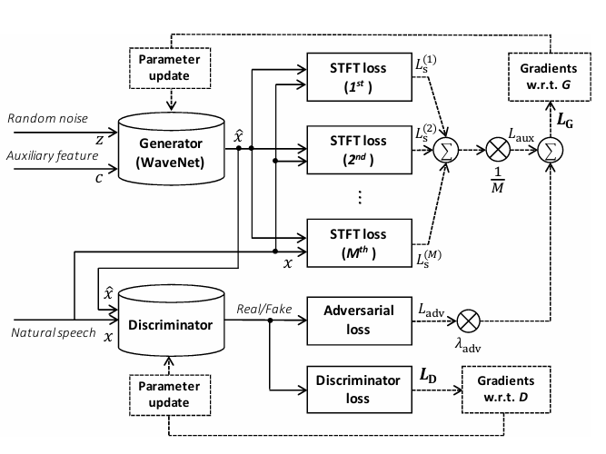
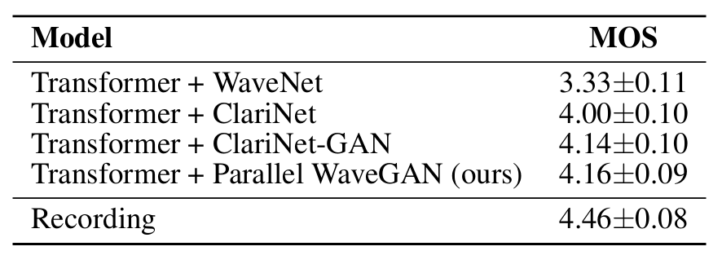

# PARALLEL WAVEGAN：一种基于多分辨率频谱图的生成对抗网络的快速波形生成模型

[toc]

## 摘要
>*我们提出了Parallel WaveGAN，这是一种使用生成对抗网络的免蒸馏、快速且占用空间小的波形生成方法。该方法通过联合优化多分辨率频谱图和对抗损失函数来训练非自回归WaveNet，能够有效捕捉真实语音波形的时频分布。由于我们的方法不需要在传统的师生框架中使用密度蒸馏，因此整个模型可以很容易地进行训练。此外，我们的模型即使在其紧凑的架构下也能够产生高清晰度的语音。特别是，所提出的Parallel WaveGAN只有1.44 M参数，可以生成24 kHz的语音波形，比在单个GPU环境下实时快28.68倍。感知听力测试结果验证了我们提出的方法在基于 Transformer 的文本转语音框架内获得了 416 的平均意见得分，这与最佳的基于蒸馏的并行 WaveNet 系统相比。*
>***索引术语**— 神经声码器、文本转语音、生成式和对抗网络、并行 WaveNet、Transformer*
## 1. 介绍
&emsp;&emsp;文本转语音（TTS）框架中的深度生成模型显著提高了合成语音序列的质量[1‒3]。值得注意的是，自回归生成模型（如WaveNet）比传统的参数声码器表现出更优越的性能[4‒8]。然而，由于它们的自回归性质，它们的推断速度较慢，因此在实时场景中的应用受到限制。
&emsp;&emsp;解决这一限制的一种方法是利用基于师生框架的快速波形生成方法[9‒11]。在这个框架中，定义为概率密度蒸馏的桥将自回归教师 WaveNet 的知识转移到基于逆自回归流 （IAF） 的学生模型 [12]。虽然IAF学生可以以合理的感知质量实现实时语音生成，但在训练过程中仍然存在问题：它不仅需要一个训练有素的教师模型，还需要一个试错方法来优化复杂的密度蒸馏过程。
&emsp;&emsp;为了克服上述问题，我们提出了一种基于生成对抗网络（GAN）的简单有效的并行波形生成方法Parallel WaveGAN[14]。与传统的基于蒸馏的方法不同，Parallel WaveGAN不需要两阶段、顺序的师生培训过程。该方法通过优化多分辨率短时傅里叶变换（STFT）和对抗损失函数的组合，仅训练了非自回归WaveNet模型，使模型能够有效捕获真实语音波形的时频分布。因此，整个训练过程变得比传统方法容易得多，并且模型可以使用少量模型参数生成自然的语音波形。我们的贡献总结如下：
- 提出了一种多分辨率STFT损失和波形域对抗损失的联合训练方法。这种方法有效地适用于传统的基于蒸馏的并行WaveNet（例如，ClariNet），以及拟议的免蒸馏并行WaveGAN。
- 由于所提出的Parallel WaveGAN可以在没有任何师生框架的情况下进行简单训练，因此我们的方法大大减少了训练和推理时间。特别是，与传统的 ClariNet 模型相比，训练过程快 4.82 倍（使用两个 NVIDIA Telsa V100 GPU 时从 13.5 天快到 2.8 天），推理过程快 1.96 倍（使用单个 NVIDIA Telsa V100 GPU 生成 24 kHz 语音波形时，实时速度从 14.62 秒提高到 28.68 秒2）。
- 我们将提出的Parallel WaveGAN与基于Transformer的TTS声学模型相结合[15‒17]。感知听觉测试验证了所提出的并行WaveGAN达到了416 MOS，这与最佳的基于蒸馏的ClariNet模型相比具有竞争力。
  
## 2. 相关工作
&emsp;&emsp;在 Parallel WaveNet 框架中使用 GAN 的想法并不新鲜。在之前的工作中，将IAF学生模型作为生成器，并通过最小化对抗性损失以及Kullback-Leibler散度（KLD）和辅助损失来共同优化[11]。随着GAN学习真实语音信号的分布，该方法显著提高了合成信号的感知质量。然而，基于密度蒸馏的复杂训练阶段限制了其利用率。
&emsp;&emsp;我们的目标是尽量减少训练传统师生框架的两阶段管道的工作量。换句话说，我们提出了一种无需任何蒸馏过程即可训练并行WaveNet的新方法。Juvela等[18]提出了类似的方法（例如，GAN激发的线性预测;GELP），通过使用对抗性训练方法产生声门激发。然而，由于 GELP 需要线性预测 （LP） 参数将声门激励转换为语音波形，因此当 LP 参数包含由 TTS 声学模型引起的不可避免的误差时，可能会发生质量下降。为了避免这个问题，我们的方法被设计为直接估计语音波形。针对语音信号的动态特性（包括声带运动和声道共振）都难以捕捉（分别由GELP中的声门激发和LP参数表示），因此，为了捕捉真实语音信号的时频分布，我们提出了一种对抗损失和多分辨率STFT损失的联合优化方法。因此，即使参数数量很少，也可以轻松训练整个模型，同时有效减少推理时间并提高合成语音的感知质量。

## 3. 方法

### 3.1. 基于GAN的并行波形生成
&emsp;&emsp;GANs是由两个独立的神经网络组成的生成模型：生成器（G）和判别器（D）[14]。在我们的方法中，使用基于辅助特征（例如，mel-频谱图）的基于WaveNet的模型作为生成器，将输入噪声并行转换为输出波形。该生成器与原始 WaveNet 的不同之处在于：（1） 我们使用非因果卷积而不是因果卷积;（2）输入是从高斯分布中抽取的随机噪声;（3）该模型在训练和推理步骤上都是非自回归的。
&emsp;&emsp;生成器通过试图欺骗鉴别器将生成器样本识别为真实样本来学习真实波形的分布。该过程是通过最小化对抗性损失 （$L_{adv}$） 来执行的，如下所示：
$$
L_{adv}(G,D)=E_{z \sim N(0,1)} [(1-D(G(z)))^2]
$$
&emsp;&emsp;其中Z表示输入白噪声。请注意，为简洁起见，省略了 G 的辅助功能。
&emsp;&emsp;另一方面，判别器经过训练，可以正确地将生成的样本分类为假样本，同时使用以下优化标准将基本事实分类为真实样本：
$$
L_D(G,D)=E_{x \sim p_data} [(1-D(x))^2] + E_{z \sim N(0,1)} [D(G(z))^2]
$$
&emsp;&emsp;其中 X 和 pdata 分别表示目标波形及其分布。
### 3.2. 多分辨率STFT辅助损耗
&emsp;&emsp;为了提高对抗训练过程的稳定性和效率，提出了一种多分辨率STFT辅助损失算法。图 1 显示了我们的框架，将多分辨率 STFT 损失与第 3.1 节中描述的对抗训练方法相结合。
&emsp;&emsp;与前人工作[11]类似，我们对单个STFT损失的定义如下：
$$
L_s(G)=E_{z \sim p(z),x \sim p_{data}} [L_{sc}(x,\hat x)+L_{mag}(x,\hat x)]
$$

*图1：我们提出的具有多分辨率STFT损失的对抗性训练框架的插图。*

&emsp;&emsp;其中x表示生成的样本（即$G(z)$），Lsc和Lmag分别表示光谱收敛和对数STFT幅度损失，定义如下[23]：
$$
\begin{align}
    L_{sc}(x,\hat x)&= 
        \frac
        {\parallel \ \mid STFT(x) \mid - \mid STFT(\hat x) \mid \ \parallel_F}
        {\parallel \ \mid STFT(x) \mid \ \parallel_F} 
    \tag 4 \\
    L_{amg}(x,\hat x)&=
        \frac
        {\parallel \ \log\mid STFT(x) \mid - \log\mid STFT(\hat x) \mid \ \parallel_1}
        {N} 
    \tag 5
\end{align}
$$
&emsp;&emsp;其中 $\parallel \cdot \parallel_F$ 和 $\parallel \cdot \parallel_1$ 分别表示 Frobenius 和 L1 范数; $\mid STFT(\cdot) \mid$ 和 $N$ 分别表示 $STFT$ 量级和元素数量（量级）
&emsp;&emsp;我们的多分辨率STFT损耗是具有不同分析参数（即FFT大小、窗口大小和帧偏移）的STFT损耗之和。设$M$为STFT损耗数，多分辨率STFT辅助损耗（$L_{aux}$）表示如下:
$$
L_{aux}(G)=\frac{1}{M} \sum^M_{m=1}L_s^{(m)}(G)
$$
&emsp;&emsp;在基于STFT的信号时频表示中，时间和频率分辨率之间存在权衡;例如，增加窗口大小可提供更高的频率分辨率，同时降低时间分辨率[24]。通过将多个STFT损失与不同的分析参数相结合，极大地帮助了生成器学习语音的时频特性[25]。此外，它还可以防止发生器过拟合到固定的STFT表示，这可能导致波形域的性能欠佳。
&emsp;&emsp;生成器的最终损失函数被定义为多分辨率STFT损失和对抗损失的线性组合，如下所示：
$$
L_G(G,D) = L_{aux}(G) + \lambda_{adv}L_{adv}(G,D) \tag{7}
$$
&emsp;&emsp;其中 $\lambda_{adv}$ 表示平衡两个损失项的超参数。通过对波形域对抗损失和多分辨率STFT损失进行联合优化，生成器可以有效地学习真实语音波形的分布。

## 4. 实验
### 4.1. 实验装置
#### 4.1.1. 数据库
&emsp;&emsp;在实验中，我们使用了由一位女性专业日语使用者录制的语音和平淡无奇的语音语料库。语音信号以 24 kHz 采样，每个样本被量化 16 位。总共有 11,449 个话语（23.09 小时）用于训练，250 个话语（0.35 小时）用于验证，另外 250 个话语（0.34 小时）用于评估。提取了具有带限频率范围4 （70至8000 Hz）的80波段对数-梅尔频谱图，并将其用作波形生成模型（即局部调理[4]）的输入辅助特征。帧和移位长度分别设置为 50 ms 和 12.5 ms。在训练之前，对 mel-spectrogram 特征进行了归一化，使其均值和单位方差为零。
#### 4.1.2. 模型详细信息
&emsp;&emsp;提出的`Parallel WaveGAN`由30层膨胀的残余卷积块组成，其中三个膨胀周期呈指数增加[4]。残差通道数和跳跃通道数设置为 64，卷积滤波器大小设置为 3。判别器由 10 层非因果扩张的 1-D 卷积组成，具有泄漏的 ReLU 激活函数 （$\alpha=0.2$）。步长设置为 1，并对从 1 到 8 的一维卷积应用线性增加的扩张，除了第一层和最后一层。通道数和滤波器尺寸与发生器相同。我们对生成器和鉴别器的所有卷积层都应用了权重归一化[26]。
&emsp;&emsp;在训练阶段，多分辨率STFT损失是通过三种不同STFT损失的总和计算的，如表1所示。鉴别器损失是通过使用鉴别器进行每时间步长标量预测的平均值来计算的。根据我们的初步实验，公式（7）中的超参数$\lambda_{adv}$被选为4.0。使用 RAdam 优化器 （$\epsilon = 1e^{-6}$） 对模型进行 400 K 步长的训练以稳定训练 [27]。请注意，前 100K 步的判别器是固定的，之后联合训练了两个模型。小批量大小设置为 8，每个音频剪辑的长度设置为 24 K 时间样本（1.0 秒）。生成器和鉴别器的初始学习率分别设置为 0.0001 和 0.00005。每 200 K 步，学习率降低一半。
&emsp;&emsp;作为基线系统，我们使用了自回归高斯WaveNet和并行系统（即ClariNet）[10,11]。WaveNet 由 24 层膨胀残余卷积块组成，具有四个膨胀周期。残余通道数和跳跃通道数设置为 128，滤波器尺寸设置为 3。使用 RAdam 优化器对模型进行 1.5 M 步长的训练。学习率设置为 0.001，每 200 K 步减少一半。小批量大小设置为 8，每个音频剪辑的长度设置为 12 K 时间样本（0.5 秒）。
&emsp;&emsp;为了训练基线 ClariNet，使用上述自回归 WaveNet 作为教师模型。ClariNet基于高斯IAFs[10]，由六个流组成。每个f低值由10层膨胀残余卷积块参数化，膨胀周期呈指数增加。残余通道数和跳跃通道数设置为 64，滤波器尺寸设置为 3。平衡KLD和STFT辅助损失的权重系数分别设置为0.5和1.0。该模型使用与并行 WaveGAN 相同的优化器设置训练了 400 K 步长。我们还研究了具有对抗性损失的ClariNet作为GAN和密度蒸馏的混合方法[11]。模型结构与基线 ClariNet 相同，但它是使用 KLD、STFT 和对抗损失的混合进行训练的，其中平衡它们的权重系数分别设置为 0.05、1.0 和 4.0。使用固定判别器对模型进行200K步长的训练，生成器和判别器对其余200K步进行联合优化。

*表 1：多分辨率 STFT 损失的详细信息。在 FFT 过程之前应用了 Hanning 窗口。*

&emsp;&emsp;在整个波形生成模型中，输入辅助特征通过最近邻上采样进行上采样，然后进行二维卷积，以便辅助特征的时间分辨率与语音波形的采样率相匹配[11,28]。请注意，辅助特征未用于鉴别器。所有模型均使用两个 NVIDIA Tesla V100 GPU 进行训练。在NAVER智能机器学习（NSML）平台上进行了实验[29]。

### 4.2. 评估
&emsp;&emsp;为了评估感知质量，我们进行了平均意见得分（MOS）检验。18 位以日语为母语的人被要求使用以下五种可能的回答对合成语音样本做出质量判断：1 = 差（bad）;2 = 较差（poor）;3 = 一般（fair）;4 = 好（good）;5 = 优秀（Excellent）。总共从评估集中随机选择了 20 个话语，然后使用不同的模型进行合成。
&emsp;&emsp;表 2 显示了不同生成模型的推理速度和 MOS 测试结果。
- 研究结果可归纳如下：
  1. 使用STFT损失训练的系统比没有STFT损失训练的系统（即自回归WaveNet）表现更好。请注意，大多数听众对自回归 WaveNet 系统引起的高频噪声不满意。这可以通过以下事实来解释：在WaveNet中，只有带限（70-8000 Hz）梅尔频谱图用于本地调理，而其他系统能够通过STFT损失直接学习全频段频率信息。
  2. 所提出的多分辨率STFT损失模型比传统的单一STFT损失模型具有更高的感知质量（分别比较系统3和系统6与系统2和系统5）。这证实了多分辨率STFT损失有效地捕获了语音信号的时频特性，从而实现了更好的性能。
  3. 拟议的对抗性损失不适用于 ClariNet。但是，当它与TTS框架结合使用时，可以发现其优势，这将在下一节中讨论。
  4. 最后，所提出的Parallel WaveGAN实现了406 MOS。虽然它的感知质量比单簧管差，但并行WaveGAN能够比单簧管快1.96倍地生成语音信号。此外，所提出的方法的优点还在于其简单的训练过程。我们测量了获得最优模型的总训练时间，如表 3 中所述。由于 Parallel WaveGAN 不需要任何复杂的密度蒸馏，因此仅需 2.8 个训练日即可进行优化，分别比自回归 WaveNet 和 ClariNet 快 264 倍和 482 倍。

*表 2：推理速度和 95% 置信区间的 MOS 结果：从录制的语音信号中提取的声学特征用于组成输入辅助特征。该评估是在配备单个 NVIDIA Tesla V100 GPU 的服务器上进行的。请注意，推理速度 k 表示系统生成波形的速度比实时快 k 倍。*

*表 3：训练时间比较：所有实验均在配备两个 NVIDIA Tesla V100 GPU 的服务器上进行。每个声码器模型分别对应于表 2 中描述的系统 1、3、4 和 6。请注意，ClariNets 的时间包括教师 WaveNet 的培训时间。*

### 4.3. 文字转语音
&emsp;&emsp;为了验证所提方法作为TTS框架声码器的有效性，我们将Parallel WaveGAN与基于Transformer的参数估计器相结合[15‒17]。
&emsp;&emsp;为了训练 Transformer，我们使用音素序列作为输入，使用从录制的语音中提取的 mel 频谱图作为输出。该模型由一个六层编码器和一个六层解码器组成，每个编码器都基于多头注意力（有八个头）。该配置遵循了之前的工作[17]，但模型被修改为接受重音作为音高重音语言（例如日语）[30]的外部输入。该模型使用具有预热学习率调度功能的 RAdam 优化器训练了 1000 个 epoch[15]。初始学习率设置为 1.0，并使用动态批量大小（平均 64）策略来稳定训练。
&emsp;&emsp;在合成步骤中，通过Transformer TTS模型将输入音素和重音序列转换为相应的梅尔频谱图。通过输入生成的声学参数，声码器模型生成了时域语音信号。
&emsp;&emsp;为了评估生成的语音样本的质量，我们进行了 MOS 测试。测试设置与第 4.2 节中描述的设置相同，但我们在测试中使用了自回归 WaveNet 和用多分辨率 STFT 损失训练的并行生成模型（系统 1、3、4 和 6 分别在表 2 中描述）。MOS测试的结果如表4所示，其结果可归纳如下：（1）在对抗性损失下训练的ClariNet比没有对抗性损失训练的系统表现更好，尽管在分析/综合情况下它们的感知质量几乎相同（系统3和表2所示）。这意味着使用对抗损失有利于提高模型对声学模型引起的预测误差的鲁棒性。(2)对抗训练的优点也对所提出的Parallel WaveGAN系统具有一定的利用。因此，采用Transformer TTS模型的Parallel WaveGAN实现了4.16 MOS，与最佳的基于蒸馏的Parallel WaveNet系统（即ClariNet-GAN）相当。

*表 4：具有 95% 置信区间的 MOS 结果：使用 Transformer TTS 模型生成的声学特征来组成输入辅助特征。*

## 5. 结论
&emsp;&emsp;我们提出了Parallel WaveGAN，这是一种基于 GAN.By 联合优化波形域对抗损失和多分辨率STFT损失的免蒸馏、快速、小尺寸的波形生成方法，我们的模型能够学习如何生成真实的波形，而无需任何复杂的概率密度蒸馏。实验结果表明，所提方法在基于Transformer的TTS框架下实现了416 MOS，与传统的基于蒸馏的方法相比具有竞争力，产生24kHz语音波形的速度比实时快28.68倍，模型参数仅为1.44M。未来的研究包括改进多分辨率STFT辅助损失，以更好地捕捉语音的特征（例如，引入与相位相关的损失），并验证其对各种语料库（包括表达性语料库）的性能。

## 6. 致谢
&emsp;&emsp;这项工作得到了韩国城南市NAVER公司的Clova Voice的支持。作者感谢韩国城南市 NAVER Corp. 的 Adrian Kim、JungWoo Ha、Muhammad Ferjad Naeem 和 Xiaodong Gu 的支持。

## 7. 参考资料
...