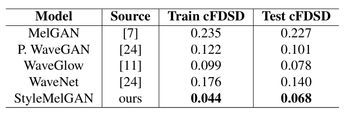
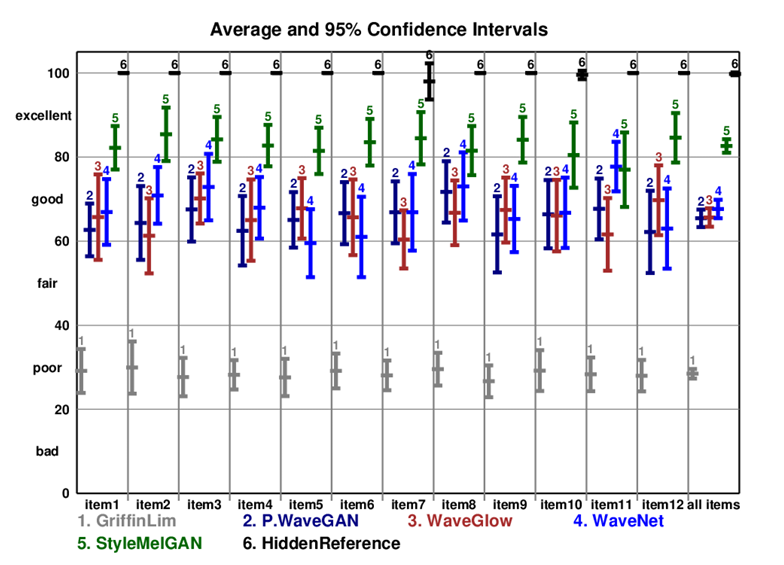
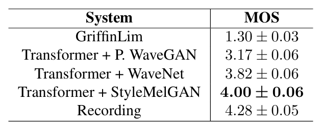
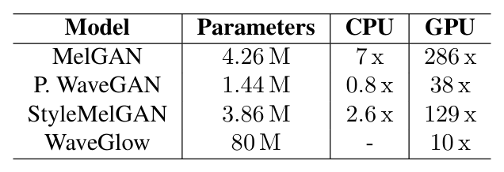

# STYLEMELGAN：具有时间自适应归一化的高效高保真对抗声码器
[toc]

## 摘要
>*近年来，神经声码器在合成语音的自然性和感知质量方面已经超越了经典的语音生成方法。计算量大的模型（如 WaveNet 和 WaveGlow）获得最佳结果，而轻量级的 GAN 模型（例如 MelGAN 和 Parallel WaveGAN）在感知质量方面仍然较差。因此，我们提出了StyleMelGAN，这是一种轻量级的神经声码器，允许以低计算复杂性合成高保真语音。StyleMelGAN 采用时间自适应归一化来设置低维噪声向量与目标语音的声学特征的样式。为了实现有效的训练，多个随机窗口判别器对抗性地评估滤波器组分析的语音信号，并通过多尺度频谱重建损失提供正则化。高度可并行化的语音生成比 CPU 和 GPU 上的实时语音生成快几倍。MUSHRA和 P.800 听力测试表明，StyleMelGAN 在复制合成和文本转语音场景中优于以前的神经声码器。*
>***索引术语** — 神经声码器、GANs、神经 PQMF、语音合成、TADE*

## 1. 引言
&emsp;&emsp;事实证明，神经声码器在许多应用中合成自然高质量语音方面优于经典方法，例如文本转语音、语音编码和语音增强。第一个合成高质量语音的突破性生成神经网络是WaveNet [1]，此后不久又开发了许多其他方法[2,3,4]。这些模型提供了最先进的质量，但通常具有非常高的计算成本和非常慢的合成速度。近年来，人们提出了大量以较低的计算成本生成语音的模型。其中一些是现有模型的优化版本[5]，而另一些则利用了与经典方法的集成[6]。此外，还引入了许多全新的方法，通常依赖于GANs[7,8,9]。大多数 GANvocoder 在 GPU 上提供非常快速的生成，但代价是牺牲合成语音的质量。
&emsp;&emsp;这项工作的主要目标是提出一种GAN架构，我们称之为StyleMelGAN，该架构可以以低计算成本和快速训练合成非常高质量的语音。StyleMelGAN 的生成器网络包含 386M 个可训练参数，并以 2205kHz 的速度合成语音，比 CPU 上的实时速度快约 26 倍，在 GPU 上比实时速度快 129 倍以上。合成以目标语音的梅尔频谱图为条件，该梅尔频谱图通过时间自适应去归一化（TADE）插入到每个生成器块中，TADE是图像合成中首次引入的特征调制[10]。这种插入调理功能的方法非常有效，据我们所知，在音频领域是新的。对抗损失由四个鉴别器组成的集合计算，每个鉴别器在可微伪正交镜滤波器组 （PQMF） 之后运行。这允许在训练期间分析语音信号的不同频段。为了使训练更加鲁棒并有利于泛化，四个判别器不依赖于生成器使用的输入声学特征，并且语音信号使用随机窗口进行采样，如图[9]所示。
- 总结一下我们的贡献：
  1. 我们介绍了 StyleMelGAN，这是一种低复杂度 GAN 声码器，用于通过 TADE 层以 mel 频谱图为条件的高保真语音合成。该生成器具有高度可并行化和完全卷积性。
  2. 上述发生器使用PQMF多采样随机窗口鉴别器的集合进行对抗训练，这些随机窗口鉴别器通过多尺度光谱重建损失进行正则化。
  3. 我们使用客观（Fréchet 分数）和主观指标来评估生成的语音的质量。为此，我们展示了两个听力测试的结果，一个是用于复制合成场景的 MUSHRA 测试，另一个是用于 TTS 的 P.800 ACR 测试，两者都证实了 StyleMelGan 实现了最先进的语音质量。

## 2. 相关工作
&emsp;&emsp;现有的神经声码器通常通过对初始波形的幅度进行建模，直接在时域中合成语音信号。这些模型中的大多数是生成神经网络，即它们对在自然语音信号中观察到的语音样本的概率分布进行建模。它们可以分为自回归和非自回归或平行分布，前者将分布显式地分解为条件分布的乘积，后者直接对联合分布进行建模。据报道，WaveNet [1]、SampleRNN [3] 和 WaveRNN [4] 等自回归模型可以合成高感知质量的语音信号 [11]。一大类非自回归模型是归一化流模型，例如 WaveGlow [2]。一种混合方法是使用逆自回归流 [5]，它使用噪声潜在表示和目标语音分布之间的分解变换。
&emsp;&emsp;GANs[12]在音频中的早期应用包括用于无条件音频生成的WaveGAN [13]和用于音乐生成的GanSynth [14]。MelGAN [7] 学习语音片段的梅尔频谱图与其相应波形之间的映射。它确保比实时生成更快，并利用多尺度判别器的对抗性训练，通过特征匹配损失进行正则化。GAN-TTS [9] 是第一个使用独特的对抗训练来生成以语言特征为条件的语音生成的 GAN 声码器。它的对抗损失由条件和无条件随机窗口判别器的集合计算。Parallel WaveGAN [8] 使用一个生成器，在结构上类似于 WaveNet，使用通过多尺度频谱重建损失进行正则化的无条件判别器进行训练。在Multiband-MelGAN中也使用了类似的想法[15]，它分别生成目标语音的每个子带，以节省计算能力，然后使用合成PQMF获得最终波形。该领域的研究非常活跃，我们可以引用最新的GAN声码器，如VocGan [16]和HiFi-GAN [17]。

## 3. STYLEMELGAN
### 3.1. 生成器架构
&emsp;&emsp;生成器模型通过以梅尔频谱图为条件的渐进上采样，将噪声向量$z \sim N(0,I_{128})$映射到22.05kHz的语音波形中。它使用时间自适应去归一化 （TADE），这是一种基于归一化激活映射的线性调制的特征调节。调制参数 $\gamma$ 和 $\beta$ 是从调理特性中自适应学习的，并且与输入激活信号具有相同的维度。该技术在[10]中首次用于语义图像合成，其中调制参数是在空间域（SPADE）中学习的。这为发生器模型的所有层提供了调节功能，从而在所有上采样阶段保留了信号结构。图 1 说明了 TADE 模块的结构。首先通过实例归一化[18]对输入激活进行归一化，以创建通过$\gamma\odot c+\beta$自适应调制的内容特征图c，其中$\odot$表示元素乘法。归一化和调制的组合代表了一种风格转移过程，它是生成器模型的核心组成部分。

*图 1：TADEResBlock 和 TADE 层。*

&emsp;&emsp;我们使用 softmax 门控 tanh 激活函数，据报道，该函数的性能优于 ReLU。Softmax门控是在[19]中提出的，它允许在音频波形生成中减少伪影。图 1 中的 TADEResBlock 是生成器模型的基本构建块。完整的生成器架构如图 2 所示。它包括八个上采样级，每个阶段由一个 TADEResBlock 和一个将信号上采样两倍的层组成，外加一个最终激活模块。最终激活包括一个 TADEResBlock，后跟一个具有 tanh 非线性的通道变化卷积层。这种设计允许仅使用 64 的通道深度进行卷积操作，最大膨胀因子为 2，从而降低了计算复杂性。

### 3.2. 滤波器组随机窗口鉴别器
&emsp;&emsp;StyleMelGAN使用四个判别器进行对抗性训练，每个鉴别器都基于[15]中提出的架构，但没有用于下采样的平均池化。此外，如[9]所述，每个鉴别器都对从输入语音波形中切成薄片的随机窗口进行操作。最后，每个判别器分析通过分析PQMF [20]获得的输入语音信号的子频段。更准确地说，我们使用 1、2、4 和 8 个子波段，分别从一秒波形中提取的 512、1024、2048 和 4096 个样本的随机窗口计算得出。图 3 展示了所提出的滤波器组随机窗口鉴别器 （FB-RWD） 的完整架构。这使得在时域和频域中对语音信号进行多分辨率对抗性评估成为可能。

*图 2：StyleMelGAN 生成器架构。*

### 3.3. 培训程序
&emsp;&emsp;众所周知，从头开始训练 GAN 是具有挑战性的。使用权重的随机初始化，对抗性损失会导致严重的音频音损和不稳定的训练。为了避免这个问题，我们遵循 [8] 中使用的相同训练过程。首先，仅使用频谱重建损失 $\mathcal{L}_{aux}$ 对生成器进行预训练，该损耗由频谱收敛的误差估计值和从 [8] 中的公式 （6） 定义的不同 STFT 分析计算的对数幅度组成。以这种方式获得的发生器能够产生非常调谐的信号，在高频下具有明显的拖尾。尽管如此，这对于对抗性训练来说是一个很好的起点，与直接从完全随机噪声信号开始相比，对抗性训练可以从更好的谐波结构中受益。然后，对抗性训练通过消除音调效应和锐化涂抹的频段，使一代人变得自然。我们使用铰链损失来评估每个判别器$D_k$的对抗度量，公式与[7]中的公式（1）相同，但$k = 1, 2, 3, 4$。光谱重建损失$\mathcal{L}_{aux}$仍用于正则化，以防止对抗伪影的出现。因此，生成器的最终目标是：
$$
\min_G(\mathbb{E}_z[\sum_{k=1}^4 -D_k(G(s,z))]+\mathcal{L}_{aux}(G))
$$
&emsp;&emsp;其中 $s$ 表示调节特性（例如，MEL 频谱图），$z$ 是潜在噪声。权重归一化 [21] 应用于 $G$ 和 $D_k$ 中的所有卷积运算。

*图 3：StyleMelGAN 鉴别器架构。每个 DBlock 都由一个 1D 卷积层组成，后跟一个 LeakyReLU，如 [15] 所示*

## 4. 实验
### 4.1. 实验设置
&emsp;&emsp;在我们的实验中，我们在 LJSpeech 语料库 [22] 上使用一个 NVIDIA Tesla V100 GPU 以 2205kHz 的频率训练 StyleMelGAN。我们使用[8]中描述的相同超参数和归一化来计算对数幅度梅尔频谱图。我们使用 Adam 优化器 [23] 对生成器进行 100k 步的预训练，学习率 $lr_g = 10^{-4}$，$\beta= \{0.5, 0.9\}$ 。在开始对抗训练时，我们设置 $lr_g = 5*10^{-5}$ 并使用 FB-RWDs 和 $lr_d = 2*10^{-4}$ 的 Adam 优化器，并且 $\beta$ 相同。FB-RWD 在每个训练步骤中多次重复随机窗口，以通过足够的梯度更新来支持模型。我们使用 32 的批次大小，批次中每个样本的段长度为 1 秒。训练持续约 $1.5M$ 步。
### 4.2. 评估
&emsp;&emsp;我们对 StyleMelGAN 与在同一数据集上训练的其他神经声码器进行客观和主观评估。对于我们所有的评估，测试集由同一演讲者录制的未可见项目组成，并从 LibriVox 在线语料库中随机选择。
&emsp;&emsp;传统的客观测量（如PESQ和POLQA）对于评估神经声码器生成的语音波形并不可靠[11]。取而代之的是，我们使用 [9] 中定义并在 [25] 中实现的条件 Fréchet 深度语音距离 （cFDSD）。表 1 显示 StyleMelGAN 优于其他对抗性和非对抗性声码器。

*表1：不同神经声码器的cFDSD分数（越低越好）。*

&emsp;&emsp;对于复制合成，我们对一组 15 名专家听众进行了 MUSHRA 听力测试，其结果如图 4 所示。我们选择了[6,11]中的这种类型的测试，因为这样可以更精确地评估生成的语音。锚点是使用 Griffin-Lim 算法的 PyTorch 实现生成的，迭代次数为 32 次。StyleMelGAN 的性能明显优于其他声码器约 15 MUSHRA 点。结果还表明，如[11]中已经发现的那样，WaveGlow产生的输出质量与WaveNet相当，同时与Parallel WaveGAN（P.WaveGAN）相当。

*图4：我们的MUSHRA专家听力测试结果。*

&emsp;&emsp;对于文本转语音，我们通过37名听众在受控环境中执行的P.800ACR[26]听力测试来评估音频输出的主观质量。使用[24]中的Transformer.v3模型生成测试集的mel频谱图。我们还添加了 Griffin-Liman chor 作为 MNRU [26] 的替代品，以校准判断量表。表 2 显示 StyleMelGAN 明显优于其他模型。

*表2：P.800ACR听力测试结果。*

&emsp;&emsp;我们在表3中报告了计算复杂度，该表显示了实时因子（RTF）的生成速度和不同并行声码器模型的参数数量。StyleMelGAN 在质量和推理速度之间提供了明显的折衷。

*表3：在CPU（Intel Core i7-6700 3.40GHz）和GPU（Nvidia Tesla V100GPU）上研究的各种型号上生成的参数数量和实时因素。*

## 5. 结论
&emsp;&emsp;这项工作介绍了 StyleMelGAN，这是一种轻量级且高效的对抗性声码器，用于在 CPU 和 GPU 上比实时更快的高保真语音合成。该模型使用时间自适应归一化 （TADE） 在目标语音的梅尔频谱图上调节生成器的每一层。对于对抗性训练，生成器与滤波器组随机窗口鉴别器竞争，后者分析不同时间尺度和多个频率子频段的合成语音信号。客观评估和主观听力测试都表明，StyleMelGAN明显优于先前的对抗性和最大似然声码器，为神经波形生成提供了新的最先进的基线。未来可能的前景包括进一步降低复杂性，以支持在低功耗处理器上运行的应用程序。

## 6. 致谢
&emsp;&emsp;感谢Fraunhofer IIS的Christian Dittmar、Prachi Govalkar、Yigitcan Özer、Srikanth Korse、JanBüthe、Kishan Gupta和Markus Multrus的热忱支持和有用的建议。

## 7. 参考资料
&emsp;&emsp;。。。

