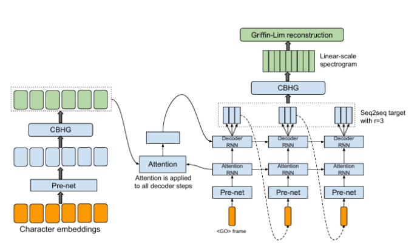
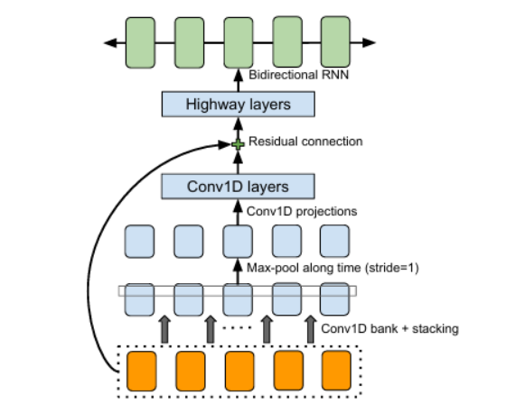
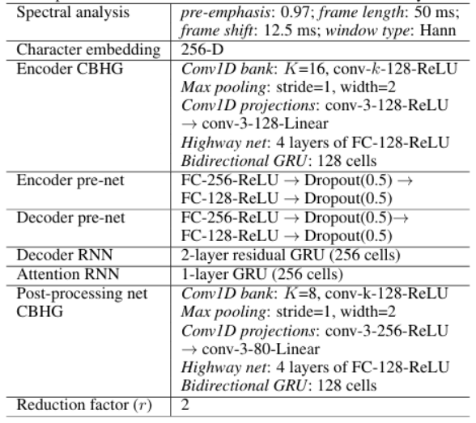
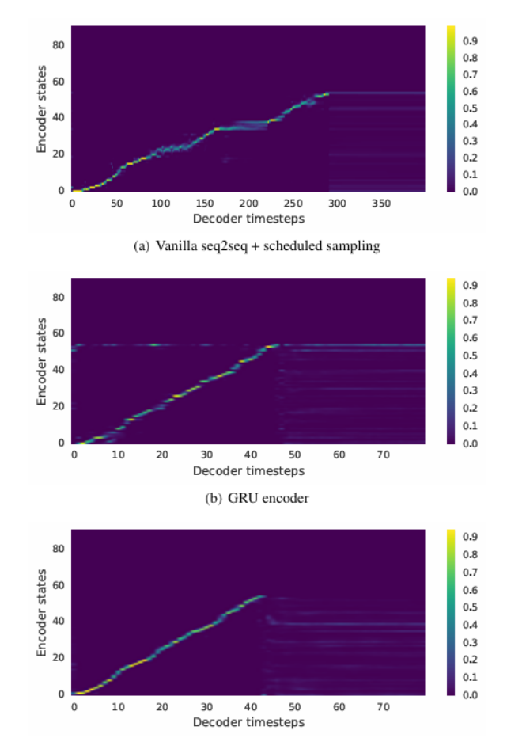
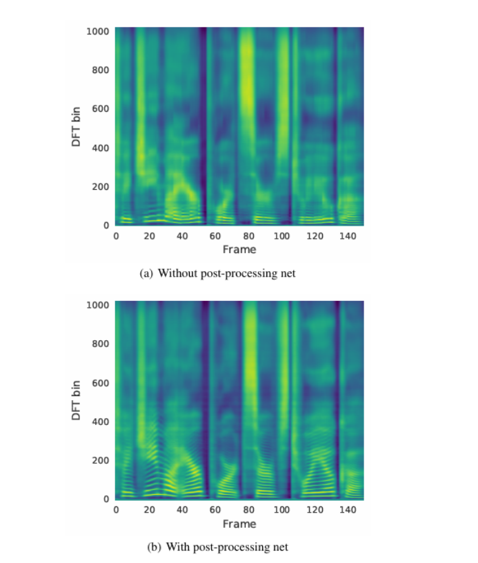
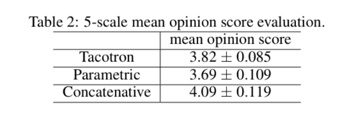

# TACOTRON：迈向端到端语音合成
## 摘要
>*text-to-speech合成系统通常由多个阶段组成，如文本分析前端、声学模型和音频合成模块。构建这些组件通常需要广泛的领域专业知识，并且可能包含脆弱的设计选择。在本文中，我们介绍了 Tacotron，这是一种端到端的生成文本转语音模型，可直接从字符合成语音。给定<文本、音频>对，模型可以通过随机初始化完全从头开始训练。我们介绍了几种关键技术，以使序列到序列框架在这项具有挑战性的任务中表现出色。Tacotron 在美式英语上取得了 3.82 的主观 5 分平均意见分数，在自然性方面优于生产参数系统。此外，由于 Tacotron 在帧级别生成语音，因此它比样本级别的自回归方法要快得多。*

## 1 引言
&emsp;&emsp;现代文本转语音 （TTS） 管道很复杂 （Taylor， 2009）。例如，统计参数TTS通常具有一个提取各种语言特征的文本前端、一个持续时间模型、一个声学特征预测模型和一个基于复杂信号处理的声码器（Zen et al.， 2009;Agiomyrgiannakis，2015 年）。这些组件基于广泛的领域专业知识，设计起来很费力。它们也是独立训练的，因此每个组件的错误都可能复杂化。现代TTS设计的复杂性导致在构建新系统时需要大量的工程工作。
&emsp;&emsp;因此，集成的端到端 TTS 系统具有许多优点，可以在<文本、音频>对上进行训练，而无需最少的人工注释。首先，这样的系统减轻了对费力的特征工程的需求，这可能涉及启发式和脆弱的设计选择。其次，它更容易允许对各种属性（如说话人或语言）或情感等高级特征进行丰富的调节。这是因为调节可以在模型的一开始发生，而不仅仅是在某些组件上发生。同样，适应新数据也可能更容易。最后，单一模型可能比多阶段模型更鲁棒，因为在多阶段模型中，每个分量的误差都可能复合。这些优势意味着，端到端模型可以让我们在现实世界中发现的大量丰富、富有表现力但往往嘈杂的数据上进行训练。
&emsp;&emsp;TTS 是一个大规模的逆问题：高度压缩的源（文本）被“解压缩”为音频。由于相同的文本可以对应不同的发音或说话风格，因此对于端到端模型来说，这是一项特别困难的学习任务：它必须应对给定输入的信号电平的巨大变化。此外，与端到端语音识别（Chan et al.， 2016）或机器翻译（Wu et al.， 2016）不同，TTS输出是连续的，输出序列通常比输入序列长得多。这些属性会导致预测误差迅速累积。在本文中，我们提出了Tacotron，这是一种基于序列到序列（seq2seq）（Sutskever et al.， 2014）和注意力范式（Bahdanau et al.， 2014）的端到端生成TTS模型。我们的模型将字符作为输入并输出原始频谱图，使用多种技术来提高原版 seq2seq 模型的能力。给定<文本、音频>对，Tacotron 可以通过随机初始化完全从头开始训练。它不需要音素级别的对齐，因此它可以轻松地扩展到使用大量声学数据和转录本。通过简单的波形合成技术，Tacotron 在 USEnglish 评估集上生成 3.82 的平均意见分数 （MOS），在自然性方面优于生产参数系统1。

*图 1：模型架构。该模型将字符作为输入，并输出相应的原始频谱图，然后将其馈送到Griffin-Lim重建算法以合成语音。*

## 2 相关工作
&emsp;&emsp;WaveNet（van den Oord et al.， 2016）是一个强大的音频生成模型。它适用于 TTS，但由于其样本级自回归特性，速度很慢。它还需要对现有 TTS 前端的语言特征进行调节，因此不是端到端的：它仅取代声码器和声学模型。另一个最近开发的神经模型是 DeepVoice（Arik 等人，2017 年），它用相应的神经网络替换了典型 TTS 管道中的每个组件。但是，每个组件都是独立训练的，更改系统以端到端方式进行训练并非易事。
&emsp;&emsp;据我们所知，Wang et al. （2016） 是最早关注使用 seq2seq 进行端到端 TTS 的工作。但是，它需要一个预训练的隐马尔可夫模型 （HMM） 对齐器来帮助 seq2seq 模型学习对齐。很难说 seq2seq 本身学习了多少对齐。其次，使用一些技巧来训练模型，作者指出这损害了韵律。第三，它预测声码器参数，因此需要一个声码器。此外，该模型是在音素输入上训练的，实验结果似乎有些有限。
&emsp;&emsp;Char2Wav（Sotelo et al.， 2017）是一个独立开发的端到端模型，可以在字符上进行训练。然而，Char2Wav仍然在使用SampleRNN神经声码器之前预测声码器参数（Mehri等人，2016），而Tacotron直接预测原始频谱图。此外，他们的 seq2seq 和 SampleRNN 模型需要单独预训练，但我们的模型可以从头开始训练。最后，我们对原版的 seq2seq 范式进行了几项关键修改。如后面所示，vanilla seq2seq 模型不适用于字符级输入。

## 3 模型架构
&emsp;&emsp;Tacotron的骨干是具有注意力的seq2seq模型（Bahdanau等人，2014;Vinyals等人，2015）。图 1 描述了该模型，其中包括一个编码器、一个基于注意力的解码器和一个后处理网络。在高层次上，我们的模型将字符作为输入并生成频谱图帧，然后将其转换为波形。我们将在下面介绍这些组件。

*图 2：CBHG（1-D 卷积银行 + 高速公路网络 + 双向 GRU）模块改编自 Lee et al. （2016）。*

### 3.1 CBHG模块
&emsp;&emsp;我们首先介绍一个名为 CBHG 的构建块，如图 2 所示。CBHG 由一组 1-D 卷积滤波器组成，其次是高速公路网络 （Srivastava et al.， 2015） 和双向门控循环单元 （GRU） （Chung et al.， 2014） 循环神经网络 （RNN）。CBHG 是一个强大的模块，用于从序列中提取表示。输入序列首先与 $K$ 个一维卷积滤波器集进行卷积，其中第 $k$ 个集包含宽度为 $k$ 的 $G_k$ 滤波器（即 $k=1,2,\dots,K$）。这些过滤器显式地对本地和上下文信息进行建模（类似于对一元组、二元组、最多 $K$ 元组进行建模）。卷积输出堆叠在一起，并随着时间的推移进一步汇集最大值，以增加局部不变性。请注意，我们使用 $1$ 的步幅来保留原始时间分辨率。我们进一步将处理过的序列传递给几个固定宽度的一维卷积，其输出通过残差连接与原始输入序列相加（He et al.， 2016）。批量归一化（Ioffe&Szegedy，2015）用于所有卷积层。卷积输出被馈送到多层高速公路网络中，以提取高级特征。最后，我们将双向 GRU RNN 堆叠在顶部，以从前向和后向上下文中提取顺序特征。CBHG 的灵感来自机器翻译的工作 （Lee et al.， 2016），其中与 Lee et al. （2016） 的主要区别包括使用非因果卷积、批量归一化、残差连接和 stride=1 max pooling。我们发现这些修改提高了泛化能力。

### 3.2 编码器
&emsp;&emsp;编码器的目标是提取文本的鲁棒性（robust）顺序表示形式。编码器的输入是一个字符序列，其中每个字符都表示为一个独热向量，并嵌入到一个连续向量中。然后，我们将一组非线性变换（统称为“pre-net”）应用于每个嵌入。在这项工作中，我们使用一个带有 dropout 的瓶颈层作为前置网络，这有助于收敛并提高泛化性。CBHG 模块将预网输出转换为注意力模块使用的最终编码器表示。我们发现，与标准的多层 RNN 编码器相比，这种基于 CBHG 的编码器不仅可以减少过拟合，而且发音错误也更少（请参阅我们的音频样本链接页面）。

*表 1：超参数和网络架构。“conv-k-c-ReLU”表示具有 k 和 c 宽度的一维卷积，并激活了 ReLU 的输出通道。FC 代表 完全连接。*

### 3.3 解码器
&emsp;&emsp;我们使用基于内容的tanh注意力解码器（参见例如Vinyals等人（2015）），其中有状态的循环层在每个解码器时间步长产生注意力查询。我们将上下文向量和注意力 RNN 单元输出连接起来，形成解码器 RNN 的输入。我们使用一堆具有垂直残差连接的GRUs（Wu等人，2016）作为解码器。我们发现残差连接加速了收敛。解码器目标是重要的设计选择。虽然我们可以直接预测原始频谱图，但它是一种高度冗余的表示，用于学习语音信号和文本之间的对齐方式（这实际上是使用 seq2seq 完成此任务的动机）。由于这种冗余，我们使用不同的目标进行 seq2seq 解码和波形合成。只要 seq2seq 目标为反演过程提供足够的可理解性和韵律信息，就可以对其进行高度压缩，该过程可以被固定或训练。我们使用 80 波段梅尔尺度频谱图作为目标，但可以使用较少的波段或更简洁的靶标，例如倒谱。我们使用后处理网络（如下所述）将 seq2seq 目标转换为波形。
&emsp;&emsp;我们使用一个简单的全连接输出层来预测解码器目标。我们发现的一个重要技巧是预测每个解码器步骤的多个非重叠输出帧。一次预测 r 帧会将解码器步数总数除以 r，从而减少模型大小、训练时间和推理时间。更重要的是，我们发现这个技巧可以大大提高收敛速度，这是通过从注意力中学到的更快（和更稳定）的对齐来衡量的。这可能是因为相邻的语音帧是相关的，并且每个字符通常对应于多个帧。一次发射一帧会强制模型在多个时间步长内处理同一输入令牌;发出多个帧可以使注意力在训练的早期向前移动。Zen et al. （2016） 也使用了类似的技巧，但主要是为了加快推理。
&emsp;&emsp;解码器的第一个步骤以全零帧为条件，该帧表示一<GO>帧。在推理中，在解码器步骤 t 处，r 预测的最后一帧作为输入在步骤 t +1 处馈送到解码器。请注意，在这里输入最后一个预测是一个临时选择 - 我们可以使用所有 r 预测。在训练期间，我们总是将每个第 r 个真值帧馈送到解码器。输入帧被传递到预网，就像在编码器中所做的那样。由于我们不使用计划采样等技术（Bengio et al.， 2015）（我们发现它会损害音频质量），因此前置网络中的丢失对于模型的泛化至关重要，因为它提供了一个噪声源来解决输出分布中的多种模态。

### 3.4 后处理网络和波形合成
&emsp;&emsp;如上所述，后处理网络的任务是将seq2seq目标转换为可以合成波形的目标。由于我们使用 Griffin-Lim 作为合成器，因此后处理网络学会了预测线性频率尺度上采样的频谱幅度。后处理网络的另一个动机是它可以看到完整的解码序列。与始终从左到右运行的 seq2seq 相比，它具有向前和向后信息，以纠正每个单独帧的预测错误。在这项工作中，我们使用CBHG模块进行后处理网络，尽管更简单的架构可能也适用。后处理网络的概念具有高度的通用性。它可以用来预测替代目标，如声码器参数，或作为类似WaveNet的神经声码器（van den Oord等人，2016;Mehri 等人，2016 年;Arik et al.， 2017），直接合成波形样本。
&emsp;&emsp;我们使用Griffin-Lim算法（Griffin&Lim，1984）从预测的频谱图中合成波形。我们发现，在馈送到 Griffin-Lim 之前将预测的幅度提高 1.2 次方可以减少伪影，这可能是由于其谐波增强效应。我们观察到 Griffin-Lim 在 50 次迭代后收敛（实际上，大约 30 次迭代似乎就足够了），这是相当快的。我们在 TensorFlow 中实现了 Griffin-Lim（Abadi et al.， 2016），因此它也是模型的一部分。虽然 Griffin-Lim 是可微分的（它没有可训练的权重），但我们在这项工作中不会对它施加任何损失。我们强调，我们选择 Griffin-Lim 是为了简单;虽然它已经产生了强大的结果，但开发快速、高质量的可训练频谱图到波形逆变器的工作仍在进行中。

## 4 模型详细信息
&emsp;&emsp;超参数和网络架构如表1所示。我们使用具有 Hann 窗口、50 ms 帧长度、12.5 ms 帧移和 2048 点傅里叶变换的对数幅度频谱图。我们还发现预加重（0.97）是有帮助的。我们使用 24 kHz 采样率进行所有实验。
&emsp;&emsp;本文使用r =2（输出层折减因子）来计算MOS结果，尽管较大的r值（例如r = 5）也效果很好。我们使用Adam优化器（Kingma&Ba，2015）进行学习率衰减，从0.001开始，分别在500K，1M和2M全局步长后减少到0.0005,0.0003和0.0001。我们对 seq2seq 解码器（梅尔尺度频谱图）和后处理网络（线性尺度频谱图）都使用简单的 1 损失。这两个损失的权重相等。
&emsp;&emsp;我们使用 32 的批处理大小进行训练，其中所有序列都填充到最大长度。使用损失掩码训练序列模型是一种常见的做法，该掩码在零填充帧上掩盖损失。然而，我们发现以这种方式训练的模型不知道何时停止发射输出，导致最后出现重复的声音。解决这个问题的一个简单技巧是重建零填充框架。

## 5 实验
&emsp;&emsp;我们在北美内部英语数据集上训练 Tacotron，该数据集包含专业女性演讲者所说的大约 24.6 小时的语音数据。这些短语是文本规范化的，例如“16”被转换为“sixteen”。

*图 3：测试短语上的注意对齐。由于使用了输出衰减因子 r=5，Tacotron 中的解码器长度较短。*

### 5.1 消融分析
&emsp;&emsp;我们进行了一些消融研究，以了解我们模型中的关键组成部分。与生成模型一样，很难比较基于客观指标的模型，而客观指标通常与感知没有很好的相关性（Theisetal.，2015）。相反，我们主要依靠视觉比较。我们强烈建议读者收听提供的样本。
&emsp;&emsp;首先，我们与Vanilla seq2seq模型进行了比较。编码器和解码器都使用 2 层残差 RNN，其中每层有 256 个 GRU 单元（我们尝试了 LSTM 并得到了类似的结果）。不使用前网或后处理网，解码器直接预测线性尺度对数幅度频谱图。我们发现，该模型需要计划抽样（采样率为 0.5）来学习对齐和泛化。我们在图 3 中展示了学习到的注意力对齐。图 3（a） 显示 vanilla seq2seq 学习的对齐效果不佳。一个问题是，注意力往往会卡在很多帧上，然后再向前移动，这会导致合成信号中的语音清晰度不佳。结果，自然性和总体持续时间被破坏了。相比之下，我们的模型学习到清晰流畅的对齐，如图 3（c） 所示。

*图 4：使用和不使用后处理网络的预测频谱图。*

&emsp;&emsp;其次，我们与用 2 层残余 GRU 编码器替换 CBHG 编码器的模型进行了比较。模型的其余部分（包括编码器预网）保持不变。比较图3（b）和图3（c），我们可以看到GRU编码器的对准噪声更大。在听合成信号时，我们发现嘈杂的对齐通常会导致发音错误。CBHG 编码器可减少过拟合，并能很好地泛化到长而复杂的短语。
&emsp;&emsp;图4（a）和4（b）显示了使用后处理网络的好处。我们训练了一个没有后处理网络的模型，同时保持所有其他组件不变（除了解码器RNN预测线性尺度频谱图）。有了更多的上下文信息，来自后处理网络的预测包含了更好的分辨率谐波（例如，bins 100和bins400之间的高谐波）和高频共振峰结构，从而减少了合成伪影。

### 5.2 平均意见分数检验
&emsp;&emsp;我们进行平均意见分数测试，要求受试者以 5 分李克特量表分数对刺激的自然性进行评分。MOS 测试是从母语人士那里采购的。
&emsp;&emsp;测试使用了 100 个看不见的短语，每个短语都获得了 8 个评分。在计算 MOS 时，我们只包括使用耳机的评级。我们将我们的模型与参数度量（基于 LSTM （Zen et al.， 2016））和串联系统 （Gonzalvo et al.， 2016） 进行比较，两者都在生产中。如表 2 所示，Tacotron 的 MOS 为 3.82，优于参数系统。鉴于Griffin-Lim合成带来的强基线和伪影，这是一个非常有希望的结果。

*表 2：5 级平均意见评分评估。*

## 6 讨论
&emsp;&emsp;我们提出了 Tacotron，这是一种集成的端到端生成 TTS 模型，它以字符序列作为输入并输出相应的频谱图。通过一个非常简单的波形合成论文模块，它在美式英语上取得了 3.82 的 MOS 分数，在自然性方面优于生产参数系统。Tacotron 是基于帧的，因此推理比样本级自回归方法快得多。与以前的工作不同，Tacotron不需要手工设计的语言特征或复杂的组件，如HMM对准器。它可以通过随机初始化从头开始训练。我们执行简单的文本规范化，尽管最近在学习文本规范化方面的广告优势（Sproat&Jaitly，2016）可能会使这将在未来变得没有必要。
&emsp;&emsp;我们还没有研究我们模型的许多方面;许多早期的设计决策都没有改变。我们的输出层、注意力模块、损失函数和基于Griffin-Lim的波形合成器都已经具备了改进的时机。例如，众所周知，Griffin-Lim 输出可能具有可听见的音损。我们目前正在研究快速、高质量的基于神经网络的频谱图反演。

## 致谢
&emsp;&emsp;作者感谢 Heiga Zen 和 Ziang Xie 的建设性讨论和反馈。

## 引用
&emsp;&emsp;。。。
