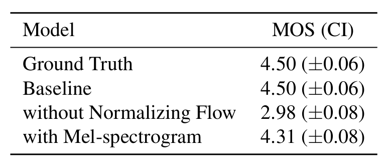

# 具有对抗学习功能的条件变分自动编码器，用于端到端文本转语音

[toc]

## 摘要
>*最近已经提出了几种支持单阶段训练和并行采样的端到端文本转语音（TTS）模型，但它们的样本质量与两阶段TTS系统不匹配。在这项工作中，我们提出了一种并行的端到端TTS方法，该方法比当前的两级模型产生更自然的音频。我们的方法采用变分推理，结合归一化流程和对抗训练过程进行增强，提高了生成建模的表现力。我们还提出了一个随机持续时间预测器，用于从输入文本中合成具有不同节奏的语音。通过对潜在变量的不确定性建模和随机持续时间预测器，我们的方法表达了自然的一一对多关系，在这种关系中，文本输入可以以多种方式以不同的音高和节奏朗读。对 LJ Speech（单说话人数据集）的主观人工评估（平均意见分数，或 MOS）表明，我们的方法优于最好的公开可用的 TTS 系统，并实现了与地面事实相当的 MOS。*

## 1. 引言
&emsp;&emsp;文本转语音 （TTS） 系统通过多个组件从给定文本合成原始语音波形。随着深度神经网络的快速发展，TTS系统管道除了文本归一化和音素化等文本预处理外，已经简化为两阶段生成建模。第一阶段是从预处理文本中产生中间语音表示，如梅尔频谱图（Shen et al.， 2018）或语言特征（Oord et al.， 2016），1 第二阶段是生成基于中间表示的原始波形（Oord et al.， 2016;Kalchbrenner 等人，2018 年）。两阶段管道中的每一条管道的模型都是独立开发的。
&emsp;&emsp;基于神经网络的自回归 TTS 系统已显示出合成真实语音的能力（Shen et al.， 2018;Li et al.， 2019），但它们的顺序生成过程使得很难充分利用现代并行处理器。为了克服这一限制并提高合成速度，已经提出了几种非自回归方法。在文本到频谱图生成步骤中，从预训练的自回归教师网络中提取注意力图谱（任等人，2019;Peng et al.， 2020） 试图降低学习文本和频谱图之间对齐的难度。最近，基于似然的方法通过估计或学习对齐来进一步消除对外部对准器的依赖，从而最大限度地提高目标梅尔频谱图的可能性（Zeng 等人，2020 年;Miao et al.， 2020;Kim 等人，2020 年）。同时，生成对抗网络（GAN）（Goodfellow等人，2014）已经在第二阶段模型中进行了探索。基于GAN的前馈网络具有多个鉴别器，每个鉴别器都区分不同尺度或周期的样本，可实现高质量的原始波形合成（Kumar等人，2019;Bi'nkowski 等人，2019 年;Kong 等人，2020 年）。
&emsp;&emsp;尽管并行 TTS 系统取得了进展，但两阶段流水线仍然存在问题，因为它们需要顺序训练或微调（Shen 等人，2018 年;Weiss 等人，2020 年）用于高质量生产，其中后期模型使用早期模型的生成样本进行训练。此外，它们对预定义中间特征的依赖性排除了应用学习的隐藏表示来进一步提高性能。最近，FastSpeech 2s（任 et al.，2021）和 EATS（Donahue et al.，2021）等几篇工作提出了高效的端到端训练方法，例如在短音频片段而不是整个波形上进行训练，利用 mel-频谱图解码器来帮助文本表示学习，以及设计专门的频谱图损失以缓解目标和生成语音之间的长度不匹配。然而，尽管利用学习到的表示有可能提高性能，但它们的合成质量落后于两阶段系统。
&emsp;&emsp;在这项工作中，我们提出了一种并行的端到端TTS方法，该方法比当前的两级模型产生更自然的音频。使用变分自动编码器（VAE）（Kingma&Welling，2014），我们通过潜在变量连接TTS系统的两个模块，以实现高效的端到端学习。为了提高我们方法的表现力，以便可以合成高质量的语音波形，我们将归一化流应用于我们的条件先验分布和波形域上的对抗训练。除了生成细粒度的音频外，TTS 系统还必须表达一对多关系，在这种关系中，文本输入可以以多种方式以不同的变化（例如，音高和持续时间）朗读。为了解决一对多问题，我们还提出了一个随机持续时间预测器，用于从输入文本中合成具有不同节奏的语音。通过对潜在变量的不确定性建模和随机持续时间预测器，我们的方法捕获了无法用文本表示的语音变化。
&emsp;&emsp;与最好的公开可用的 TTS 系统 Glow-TTS （Kim et al.， 2020） with HiFi-GAN （Kong et al.， 2020） 相比，我们的方法获得了更自然的语音和更高的采样效率。我们将演示页面和源代码都公开提供。

## 2. 方法
&emsp;&emsp;在本节中，我们将解释我们提出的方法及其架构。所提出的方法主要在前三个小节中描述：有条件的 VAE 公式;从变分推理得出的对齐估计;用于提高合成质量的对抗性训练。本部分末尾将介绍总体体系结构。图 1a 和 1b 分别显示了我们方法的训练和推理过程。从现在开始，我们将把我们的方法称为变分推理，用于端到端文本转语音 （VITS） 的对抗性学习。

*图 1.描述（a）训练过程和（b）推理过程的系统图。所提出的模型可以看作是有条件的VAE;后验编码器、解码器和条件先验（绿色块：归一化流、线性投影层和文本编码器），具有基于流的随机持续时间预测器。*

### 2.1. 变分推理
#### 2.1.1. 概述
&emsp;&emsp;VITS 可以表示为条件 VAE，其目标是最大化数据对数 $p_\theta(x|c)$ 的棘手边际对数似然的变分下限，也称为证据下限 （ELBO）：
$$
\begin{align}
    \log p_\theta(x|c) \geq 
    \mathbb{E}_{q_\phi(z|x)}
        [\log p_\theta(x|z)-
            \log \frac{q_\phi(z|x)}{p_\theta(z|c)}
        ]
\end{align}
$$
&emsp;&emsp;其中 $p_\theta(z|c)$ 表示给定条件 $c$ 的潜在变量 $z$ 的先验分布，$p_\theta(x|z)$ 是数据点 $x$ 的似然函数，$q_\phi(z|x)$ 是近似后验分布。然后，训练损失为负 ELBO，它可以看作是重建损失 $-\log p_\theta(x|z)$ 和 KL 散度 $\log q_\phi(z|x) - \log p_\theta(z|c)$ 之和，其中 $z \sim q_\phi(z|x)$。

#### 2.1.2. 重建损失
&emsp;&emsp;作为重建损失中的目标数据点，我们使用 mel 频谱图而不是用 $x_{mel}$ 表示的原始波形。我们通过解码器将潜在变量 $z$ 上采样到波形域 $\hat y$，并将 $\hat y$ 转换为 mel 频谱图域 xmel。然后，将预测的和目标的梅尔频谱图之间的$L_1$损失用作侦察结构损失：
$$
\begin{align}
    L_{recon}=\parallel x_{mel} - \hat{x}_{mel} \parallel_1
\end{align}
$$
&emsp;&emsp;这可以看作是假设数据分布为拉普拉斯分布并忽略常数项的最大似然估计。我们定义了mel-spectrogram域中的重建损失，通过使用近似于人类听觉系统响应的mel-scale来提高感知质量。请注意，从原始波形估计的 mel-spectrogram 不需要可训练的参数，因为它仅使用 STFT 和线性投影到 mel-scale 上。此外，估计仅在训练期间使用，而不是推理。在实践中，我们不会对整个潜在变量 z 进行上采样，而是使用部分序列作为解码器的输入，解码器是用于高效端到端训练的窗口生成器训练（任 et al.， 2021;Donahue 等人，2021 年）。

#### 2.1.3. KL背离(KL-DIVERGENCE)
&emsp;&emsp;前验编码器$c$的输入条件由从文本中提取的音素$c_{text}$和音素与潜在变量之间的对齐A组成。对齐是一个硬单调注意力矩阵，具有 $|c_{text}| \times |x|$ 维度，表示每个输入音素扩展以与目标语音进行时间对齐的时间。由于对齐没有地面实况标签，因此我们必须估计每次训练迭代的对齐，我们将在第 2.2.1 节中讨论。在我们的问题设置中，我们的目标是为后置编码器提供更多高分辨率的信息。因此，我们使用目标语音 xlin 的线性尺度频谱图作为输入，而不是 mel-频谱图。请注意，修改后的输入不会违反变分推理的属性。那么，KL的背离是：
$$
\begin{align} \tag 3
L_kl = \log q_\phi(z|x_{lin}) - \log p_\theta(z|c_{text},A)，\\ 
z \sim q_\phi(z|x_{lin}) = N(z;\mu_\phi(x_{lin}),\sigma_\phi(x_{lin}))
\end{align}
$$
&emsp;&emsp;分解正态分布用于参数化我们的先验和后验编码器。我们发现，提高先验分布的表现力对于生成真实样本非常重要。因此，我们应用归一化流f（Rezende&Mohamed，2015），它允许在因式分解正态先验分布之上，按照变量变化规则将简单分布可逆转换为更复杂的分布：
$$
\begin{align}
    p_\theta(z|c)=N(f_\theta(z);\mu_\theta(c),\sigma_\theta(c))
        |\det \frac{\partial f_\theta(z)}{\partial z}|, c=[c_{text},A]
\end{align}
$$

### 2.2. 对齐估计
#### 2.2.1. 单调对齐搜索
&emsp;&emsp;为了估计输入文本和目标语音之间的对齐 A，我们采用单调对齐搜索 （MAS） （Kim et al.， 2020），这是一种搜索对齐的方法，该对齐方式可以最大限度地提高通过归一化流 $f$ 参数化数据的可能性：
$$
\begin{align} 
    A &= \arg\max_{\hat A} \log p(x|c_{text},\hat A) \\
    &= \arg\max_{\hat A} \log N(f(x);\mu(c_{text},\hat A),\sigma(c_{text},\hat A)) 
\tag 5
\end{align}
$$
&emsp;&emsp;在人类按顺序阅读文本而不跳过任何单词之后，候选对齐被限制为单调和非跳过。为了找到最佳对齐方式，Kim et al. （2020） 使用动态规划。在我们的环境中直接应用 MAS 很困难，因为我们的目标是 ELBO，而不是确切的对数似然。因此，我们重新定义 MAS 以找到最大化 ELBO 的对齐，从而简化为找到最大化潜在变量 $z$ 的对数似然的对齐：
$$
\begin{align} \tag 6
    &\arg\max_{\hat A} \log p_\theta(x_{mel}|z) 
    - 
    \log \frac{q_\phi(z|x_{lin})}{p_\theta(z|c_{text},\hat A)} \\
    &= \arg\max_{\hat A} \log p_\theta(z|c_{text},\hat A) \\
    &= \log N(f_\theta(z);\mu(c_{text},\hat A),\sigma(c_{text},\hat A)) \tag 6
\end{align}
$$
&emsp;&emsp;由于等式 5 与等式 6 的相似性，我们可以不加修改地使用原始的 MAS 实现。附录 A 包括 MAS 的伪代码。

#### 2.2.2. 从文本预测持续时间
&emsp;&emsp;我们可以通过对估计对齐 $\sum_j A_{i,j}$ 的每一行中的所有列相来计算每个输入标记 $d_i$ 的持续时间。正如之前的工作（Kim et al.， 2020）所提出的，持续时间可用于训练确定性持续时间预测器，但它无法表达一个人每次以不同的语速说话的方式。为了生成类似人类的语音节奏，我们设计了一个随机持续时间预测器，使其样本遵循给定音素的持续时间分布。随机持续时间预测器是一种基于流的生成模型，通常通过最大似然估计进行训练。然而，最大似然估计的直接应用是困难的，因为每个输入音素的持续时间是 1） 一个离散整数，需要对其进行去量化以使用连续归一化流，以及 2） 标量，这阻止了由于可逆性而导致的高维变换。我们应用变分去量化（Ho et al.， 2019）和变分数据增强（Chen et al.， 2020）来解决这些问题。具体来说，我们引入了两个随机变量 $u$ 和 $\nu$，它们具有与持续时间序列 d 相同的时间分辨率和维度，分别用于变分均衡和变分数据增强。我们将 $u$ 的支持度限制为 [0,1)，使差分 $d-u$ 成为正实数序列，并且我们按通道连接 $\nu$ 和 $d$ 以产生更高维的潜在表示。我们通过近似后验分布 $q_\phi(u,\nu|d,c_{text})$ 对这两个变量进行采样。结果目标是音素持续时间的对数似然的变分下限：
$$
\begin{align} 
    \log p_\theta(d|c_{text}) \geq 
    \mathbb{E}_{q_\phi(u,\nu|d,c_{text})} 
    [
        \log \frac
        {p_\theta(d-u,\nu|c_{text})}{q_\phi(u,\nu|d,c_{text})}
    ]
\end{align}
$$
&emsp;&emsp;训练损失 $L_{dur}$ 是负变分下限。我们将停止梯度算子（van den Oord et al.， 2017）应用于输入条件，该运算符可防止输入梯度反向传播，以便持续时间预测器的训练不会影响其他模块的训练。
&emsp;&emsp;取样程序相对简单;音素持续时间是通过随机持续时间预测器的逆变换从随机噪声中采样的，然后将其转换为整数。

### 2.3. 对抗性训练
&emsp;&emsp;为了在我们的学习系统中采用对抗性训练，我们添加了一个判别器 $D$，用于区分解码器 $G$ 生成的输出和真值波形 $y$。在这项工作中，我们使用了两种在语音合成中成功应用的损失类型;用于对抗训练的最小二乘损失函数（Mao等人，2017），以及用于训练生成器的额外特征匹配损失（Larsen et al.， 2016）：
$$
\begin{align} 
    L_{adv}(D) &= \mathbb{E}_{(y,z)}[(D(y)-1)^2-(D(G(z)))^2] \\
    L_{adv}(G) &= \mathbb{E}_{z}[(D(G(z))-1)^2] \\
    L_{fm}(G) &= \mathbb{E}_{(y,z)}
        \Big [
            \sum_{l=1}^T \frac{1}{N_l}
            \parallel D^l(y) - D^l(G(z)) \parallel_1
        \Big ] 
\end{align}
$$
&emsp;&emsp;其中 $T$ 表示判别器中的总层数，$D^l$ 输出判别器第 l 层的特征图，特征数为 $N_l$。值得注意的是，特征匹配损失可以看作是在判别器的隐藏层中测量的重建损失，被认为是VAE的元素重建损失的替代方案（Larsen等人，2016）。

### 2.4. 最终损失
&emsp;&emsp;通过VAE和GAN训练的结合，我们的条件VAE训练的总损失可以表示为：
$$
\begin{align} 
    L_{vae} = L_{recon} + L_{kl} + L_{dur} + L_{adv}(G) + L_{fm}(G)
\end{align}
$$

### 2.5. 模型架构
&emsp;&emsp;所提模型的整体架构由后验编码器、先验编码器、解码器、判别器和随机持续时间预测器组成。后验编码器和判别器仅用于训练，不用于推理。架构详细信息可在附录 B 中找到。

#### 2.5.1. 后验编码器
&emsp;&emsp;对于后验编码器，我们使用 WaveGlow（Prenger 等人，2019 年）和 Glow-TTS（Kim 等人，2020 年）中使用的非因果 WaveNet 残差块。WaveNet 残差块由具有门控激活单元和跳过连接的膨胀卷积层组成。块上方的线性投影层产生正态后验分布的均值和方差。对于多说话人的情况，我们在残差块中使用全局条件反射（Oord et al.， 2016）来添加说话人嵌入。

#### 2.5.2. 先验编码器
&emsp;&emsp;先验编码器由一个文本编码器和一个归一化流 $f_\theta$ 组成，前者用于处理输入音素 $c_{text}$，后者提高了前验分布的灵活性。文本编码器是一种转换器编码器（Vaswani et al.， 2017），它使用相对位置表示（Shaw et al.， 2018）而不是绝对位置编码。我们可以通过文本编码器和文本编码器上方的线性投影层从 $c_{text}$ 获取隐藏表示 $h_{text}$，该投影层产生用于构造先验分布的均值和方差。归一化流是一堆仿射耦合层（Dinh等人，2017），由一堆WaveNet残差块组成。为简单起见，我们将归一化流设计为具有 1 的雅可比行列式的体积保持变换。对于多扬声器设置，我们将扬声器嵌入添加到通过全局调节的归一化流中的残差块中。

#### 2.5.3. 解码器
&emsp;&emsp;解码器本质上是 HiFi-GAN V1 生成器（Kong 等人，2020 年）。它由一堆转置卷积组成，每个卷积后面都有一个多感受场融合模块 （MRF）。MRF的输出是具有不同感受野大小的残差块的输出之和。对于多扬声器设置，我们添加了一个线性层，用于转换扬声器嵌入，并将其添加到输入潜在变量 $z$。

#### 2.5.4. 鉴别器
&emsp;&emsp;我们遵循 HiFi-GAN 中提出的多周期判别器的判别器架构（Kong et al.， 2020）。多周期鉴别器是基于马尔可夫窗口的子鉴别器（Kumar et al.， 2019）的混合体，每个子鉴别器都对输入波形的不同周期模式进行操作。

#### 2.5.5. 随机持续时间预测器
&emsp;&emsp;随机持续时间预测器根据条件输入 $h_{text}$ 估计音素持续时间的分布。为了有效地参数化随机度预测器，我们将残差块与膨胀和深度可分离的卷积层堆叠在一起。我们还将神经样条流（Durkan et al.， 2019）应用于耦合层，该流通过使用单调有理二次样条采用可逆非线性变换的形式。与常用的仿射耦合层相比，神经样条流在参数数量相似的情况下提高了变换表达能力。对于多扬声器设置，我们添加了一个线性层，用于转换扬声器嵌入并将其添加到输入 $h_{text}$ 中。

## 3. 实验
### 3.1. 数据集
&emsp;&emsp;我们在两个不同的数据集上进行了实验。我们使用 LJ Speech 数据集（Ito，2017）与其他公开可用的模型和 VCTK 数据集（Veaux et al.， 2017）进行比较，以验证我们的模型是否可以学习和表达多样化的语音特征。LJ Speech 数据集由单个说话人的 13,100 个短音频片段组成，总长度约为 24 小时。音频格式是 16 位 PCM，采样率为 22 kHz，我们在没有任何操作的情况下使用它。我们将数据集随机分为训练集（12,500 个样本）、验证集（100 个样本）和测试集（500 个样本）。VCTK数据集由大约44,000个短音频片段组成，这些音频片段由109位以英语为母语的人说出，口音各不相同。音频剪辑的总长度约为 44 小时。音频格式为 16 位 PCM，采样率为 44 kHz。我们将采样率降低到 22 kHz。我们将数据集随机分为训练集（43,470 个样本）、验证集（100 个样本）和测试集（500 个样本）。

### 3.2. 预处理
&emsp;&emsp;我们使用线性频谱图，该频谱图可以通过短时傅里叶变换 （STFT） 从原始波形中获得，作为后验编码器的输入。变换的 FFT 大小、窗口大小和跃点大小分别设置为 1024、1024 和 256。我们使用 80 个波段梅尔尺度频谱图进行重建损失，这是通过将梅尔滤波器组应用于线性光谱图而获得的。
&emsp;&emsp;我们使用国际音标 （IPA） 序列作为前一个编码器的输入。我们使用开源软件将文本序列转换为 IPA 音素序列（Bernard，2021），并且在实现 Glow-TTS 后，转换的序列穿插一个空白标记。

### 3.3. 培训
&emsp;&emsp;网络使用 AdamW 优化器（Loshchilov & Hutter，2019）进行训练，其中 $\beta_1 = 0.8$、$\beta_2 = 0.99$ 和权重衰减 $\lambda= 0.01$。学习率衰减由每个时期的 $0.999^{1/8}$ 因子调度，初始学习率为 $2\times 10^{-4}$。继之前的工作之后（任等人，2021 年;Donahue et al.， 2021），我们采用窗口生成器训练，这是一种仅生成一部分原始波形的方法，以减少训练期间的训练时间和内存使用。我们随机提取窗口大小为 32 的潜在表示片段以馈送到解码器，而不是馈送整个潜在表示，并且还从真值原始波形中提取相应的音频段作为训练目标。我们在 4 个 NVIDIA V100 GPU 上使用混合精度训练。每个 GPU 的批处理大小设置为 64 个，模型的训练步骤最多为 800k。

### 3.4. 用于比较的实验装置
&emsp;&emsp;我们将我们的模型与最好的公开模型进行了比较。我们使用 Tacotron 2（一种自回归模型）和 Glow-TTS（一种基于流动的非自回归模型）作为第一阶段模型，并使用 HiFi-GAN 作为第二阶段模型。我们使用了他们的公共实现和预训练的权重。由于两阶段TTS系统理论上可以通过顺序训练实现更高的合成质量，因此我们将微调的HiFi-GAN纳入了高达100k步的预测输出，以及第一阶段模型的预测输出。我们实证发现，在教师强制模式下，使用 Tacotron 2 生成的 mel 频谱图微调 HiFi-GAN 比使用 Glow-TTS 生成的 mel 频谱图进行微调可使 Tacotron 2 和 Glow-TTS 的质量更好，因此我们将更好的微调 HiFi-GAN 附加到 Tacotron 2 和 Glow-TTS 中。
&emsp;&emsp;由于每个模型在抽样过程中都有一定程度的随机性，因此我们修复了在整个实验过程中控制每个模型随机性的超参数。Tactron 2 的前网中丢失的概率设置为 0.5。对于 Glow-TTS，先前分布的标准差设置为 0.333。对于VITS，将随机持续时间预测器的输入噪声标准差设置为0.8，并将比例因子0.667乘以先前分布的标准差。

## 4. 结果
### 4.1. 语音合成质量
&emsp;&emsp;我们进行了众包 MOS 测试来评估质量。评分者听取了随机选择的音频样本，并以 5 分制从 1 到 5 对他们的自然度进行评分。评分者被允许对每个音频样本进行一次评估，我们将所有音频剪辑归一化，以避免幅度差异对分数的影响。这项工作中的所有质量评估都是以这种方式进行的。
&emsp;&emsp;评估结果如表1所示。VITS的性能优于其他TTS系统，并实现了与地面实况相似的MOS。VITS （DDP） 采用与 Glow-TTS 相同的确定性持续时间预测器架构，而不是随机持续时间预测器，在 MOS 评估中，它在 TTS 系统中得分第二高。这些结果表明：1）随机持续时间预测器比确定性持续时间预测器生成更真实的音素持续时间，以及2）我们的端到端训练方法是一种有效的方法，即使保持相似的持续时间预测器架构，也可以比其他TTS模型生成更好的样本。

*表 1.在 LJ Speech 数据集上评估的 MOS 与 95% 置信区间的比较。*

&emsp;&emsp;我们进行了一项消融研究，以证明我们方法的有效性，包括先前编码器中的归一化流量和线性尺度频谱图后验输入。消融研究中的所有模型都经过了高达 300k 步的训练。结果如表2所示。在先前的编码器中去除归一化流会导致基线降低1.52 MOS，这表明先前分布的灵活性会显着影响合成质量。用mel-频谱图代替后验输入的线性尺度频谱图会导致质量下降（-0.19 MOS），表明高分辨率信息对VITS提高合成质量是有效的。

*表 2.消融研究中的 MOS 比较。*

### 4.2. 泛化到多说话人文本转语音
&emsp;&emsp;为了验证我们的模型可以学习和表达不同的语音特征，我们将我们的模型与 Tacotron 2、Glow-TTS 和 HiFi-GAN 进行了比较，它们显示出扩展到多说话人语音合成的能力（Jia et al.， 2018;Kim 等人，2020 年;Kong 等人，2020 年）。我们在VCTK数据集上训练了模型。我们将说话人嵌入添加到我们的模型中，如第 2.5 节中所述。对于 Tacotron 2，我们广播了扬声器嵌入并将其与编码器输出连接起来，而对于 Glow-TTS，我们在之前的工作之后应用了全局调节。评估方法与第 4.1 节中描述的相同。如表 3 所示，我们的模型比其他模型实现了更高的 MOS。这表明我们的模型以端到端的方式学习和表达各种语音特征。

*表 3.在 VCTK 数据集上评估的 MOS 与 95% 置信区间的比较。*

### 4.3. 语音变化
&emsp;&emsp;我们验证了随机持续时间预测器产生了多少种不同的语音长度，以及合成样本有多少种不同的语音特征。与 Valle et al. （2021） 类似，这里的所有样本都是由一句话“有多少变化？图 2a 显示了每个模型生成的 100 个话语的长度直方图。虽然由于确定性持续时间预测器，Glow-TTS 仅生成固定长度的话语，但我们模型的样本遵循与 Tacotron2 相似的长度分布。图 2b 显示了在多说话人设置中，我们的模型中的五个说话人身份中的每一个都生成的 100 个话语的长度，这意味着该模型学习了说话人依赖的音素持续时间。图3中使用YIN算法（De Cheveign'e&Kawahara，2002）提取的10个话语的F0轮廓显示，我们的模型生成具有不同音调和节奏的语音，而Figure3d中每个不同说话人身份生成的五个样本表明，我们的模型为每个说话人身份表达了非常不同的语音长度和音调。请注意，Glow-TTS可以通过增加先验分布的标准差来增加音高的多样性，但相反，它可能会降低合成质量。

*图2.（a） LJSpeech 数据集和 （b） VCTK 数据集上的样本持续时间（以秒为单位）。*

### 4.4.合成速度
&emsp;&emsp;我们比较了我们模型与并行两阶段TTS系统Glow-TTS和HiFi-GAN的合成速度。我们测量了整个过程中的同步经过时间，以从音素序列中生成原始波形，这些句子是从 LJSpeech 数据集的测试集中随机选择的 100 个句子。我们使用了单个 NVIDIA V100 GPU，批量大小为 1 。结果如表4所示。由于我们的模型不需要模块来生成预定义的中间表示，因此其采样效率和速度大大提高。

*图3.“有多少变化？”这句话的音高轨道。样本由单扬声器设置中的 （a）VITS、（b）Tacotron2 和 （c）Glow-TTS 生成，以及多扬声器设置中的 （d）VITS 生成。*

## 5.相关工作
### 5.1.端到端文本转语音
&emsp;&emsp;目前，具有两阶段管道的神经TTS模型可以合成类似人类的语音（Oordetal.，2016;Pingetal.， 2018;Shenetal.，2018 年）。但是，它们通常需要使用第一阶段模型输出进行训练或微调的声码器，这会导致训练和部署效率低下。他们也无法从端到端方法中获得潜在优势，该方法可以使用学习的隐藏表示而不是预定义的中间特征。
&emsp;&emsp;最近，已经提出了单级端到端TTS模型，以解决直接从文本生成原始波形的更具挑战性的任务，原始波形包含比mel频谱图更丰富的信息（例如，高频响应和相位）。FastSpeech 2s （任 et al.， 2021） 是 FastSpeech 2 的扩展，通过采用对抗训练和辅助 mel-spectrogram 解码器来帮助学习文本表示，从而实现端到端并行生成。但是，为了解决一对多问题，FastSpeech 2s 必须从用作训练输入条件的语音中提取音素持续时间、音高和能量。EATS（Donahue 等人，2021 年）也采用了对抗性训练和可区分的对齐方案。为了解决生成语音和目标语音之间的长度不匹配问题，EATS采用了通过动态规划计算的软动态时间扭曲损失。Wave Tacotron （Weiss et al.， 2020） 将归一化流与 Tacotron 2 相结合，以实现端到端结构，但仍然是自回归的。上述所有端到端 TTS 型号的音频质量都低于两级型号。

*表 4.合成速度的比较。$n$ kHz 的速度意味着模型每秒可以生成 $n\times1000$ 个原始音频样本。实时性是指实时性的合成速度。*

&emsp;&emsp;与上述端到端模型不同，通过利用条件 VAE，我们的模型 （1） 学习直接从文本合成原始波形，而无需额外的输入条件，（2） 使用动态规划方法 MAS 来搜索最佳对齐而不是计算损失，（3） 并行生成样本，以及 （4） 优于最好的公开可用的两阶段模型。

### 5.2. 变分自动编码器
&emsp;&emsp;VAEs（Kingma &Welling， 2014）是使用最广泛的基于似然的深度生成模型之一。我们在TTS系统中采用了有条件的VAE。条件 VAE 是一种条件生成模型，其中观察到的条件调节用于生成输出的潜在变量的先验分布。在语音合成方面，Hsu et al. （2019） 和 Zhang et al. （2019） 结合 Tacotron 2 和 VAE 来学习语音风格和韵律。BVAE-TTS（Lee等人，2021）基于双向VAE并行生成梅尔频谱图（Kingma等人，2016）。与之前将VAE应用于第一阶段模型的工作不同，我们采用VAE到并行的端到端TTS系统中。
&emsp;&emsp;Rezende & Mohamed （2015）， Chen et al. （2017） 和 Ziegler &Rush （2019） 通过归一化流动增强前后分布的表达能力，提高了 VAE 性能。为了提高先验分布的表示能力，我们在条件先验网络中添加了归一化流，从而生成更真实的样本。
&emsp;&emsp;与我们的工作类似，马等人（2019）提出了一种条件VAE，该VAE在条件先验网络中归一化流，用于非自回归神经机器翻译FlowSeq。然而，我们的模型可以显式地将潜在序列与源序列对齐，这与FlowSeq不同，FlowSeq需要通过注意力机制学习隐式对齐。我们的模型通过 MAS 将潜序列与时间对齐的源序列进行匹配，从而消除了将潜序列转换为标准正态随机变量的负担，从而实现了更简单的归一化流架构。

### 5.3. 非自回归文本转语音中的持续时间预测
&emsp;&emsp;自回归TTS模型（Taigman等人，2018;Shen et al.， 2018;Valle et al.， 2021） 通过其自回归结构和一些技巧生成具有不同节奏的多样化语音，包括在推理和启动期间保持辍学概率（Graves，2013 年）。并行TTS模型（任等人，2019;Peng et al.， 2020;Kim 等人，2020 年;任等人，2021;另一方面，Lee et al.， 2021） 一直依赖于确定性持续时间预测。这是因为并行模型必须预测目标音素持续时间或一个前馈路径中目标语音的总长度，这使得很难捕获语音节奏的相关联合分布。在这项工作中，我们提出了一个f low-based 随机持续时间预测器，该预测器学习估计音素持续时间的联合分布，从而并行生成不同的语音节奏。

## 6. 结论
&emsp;&emsp;在这项工作中，我们提出了一个并行的TTS系统VITS，它可以以端到端的方式学习和生成。我们进一步引入了随机持续时间预测器来表达不同的语音节奏。由此产生的系统直接从文本中合成自然的语音波形，而无需经过预定义的中间语音表示。实验结果表明，该方法优于两阶段TTS系统，达到了接近人类的质量。我们希望所提出的方法能够用于许多语音合成任务中，其中使用了两阶段TTS系统，以实现性能提升并享受简化的训练过程。我们还想指出，尽管我们的方法在TTS系统中集成了两个独立的生成管道，但仍然存在文本预处理的问题。研究语言表示的自监督学习可能是删除文本预处理步骤的一个可能方向。我们将发布我们的源代码和预训练模型，以促进未来方向的大量研究。

## 致谢 
&emsp;&emsp;我们要感谢 Sungwon Lyu、Bokyung Son、Sunghyo Chung 和 Jonghoon Mo 提供的有益讨论和建议。

## 引用
&emsp;&emsp;。。。