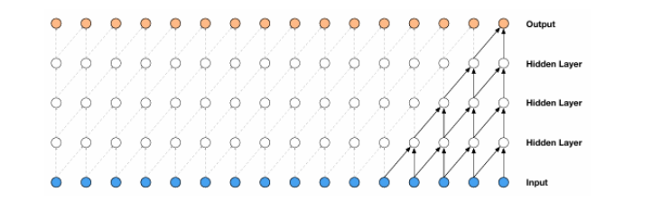
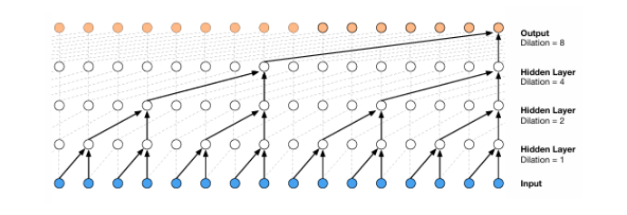
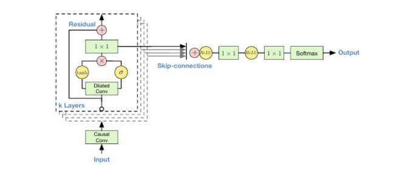
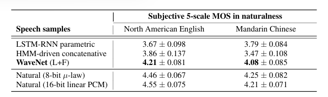
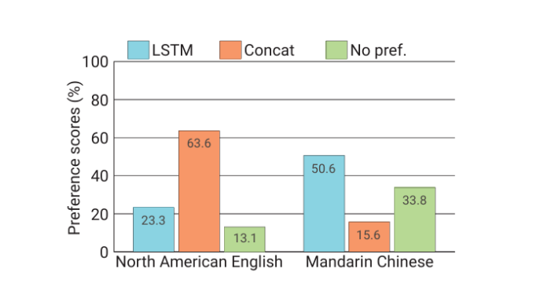
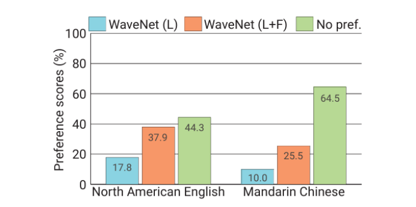
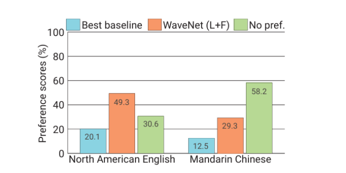
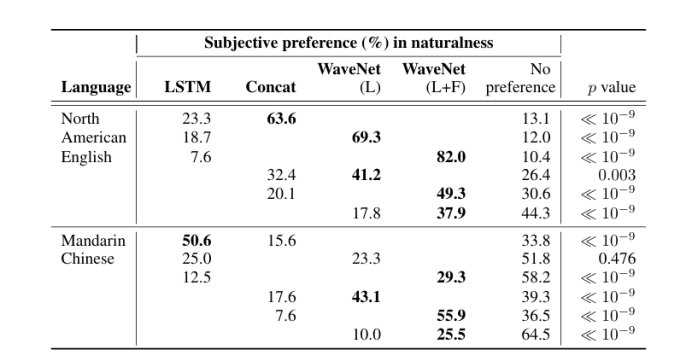

# WAVENET：原始音频的生成模型

[toc]

## 摘要
>*本文介绍了 WaveNet，这是一种用于生成原始音频波形的深度神经网络。该模型是完全概率和自回归的，每个音频样本的预测分布都以所有先前的样本为条件;尽管如此，我们还是证明了它可以在每秒数万个音频样本的数据上进行有效的训练。当应用于文本转语音时，它会产生最先进的性能，人类听众认为它比英语和普通话的最佳参数和连接系统听起来更自然。单个 WaveNet 可以以相同的保真度捕获许多不同扬声器的特性，并可以通过调节扬声器身份在它们之间切换。当训练对音乐进行建模时，我们发现它可以生成新颖且通常高度逼真的音乐片段。我们还表明，它可以用作判别模型，为音素识别返回有希望的结果。*

## 1 引言
&emsp;&emsp;这项工作探索了原始音频生成技术，其灵感来自神经自回归生成模型的最新进展，该模型对图像等复杂分布进行建模（van den Oord et al.， 2016a;b）和文本（J'ozefowicz et al.， 2016）。使用神经架构作为条件分布的乘积来对像素或单词的联合概率进行建模，可以产生最先进的生成。
&emsp;&emsp;值得注意的是，这些架构能够对数千个随机变量的分布进行建模（例如，PixelRNN 中的 64 64 个像素（van den Oord et al.， 2016a））。本文要解决的问题是，类似的方法是否能够成功生成宽带原始音频波形，这些波形是具有非常高时间分辨率的信号，每秒至少16,000个样本（见图1）。

*图 1：生成的语音的一秒钟。*

&emsp;&emsp;本文介绍了WaveNet，一种基于PixelCNN的音频生成模型（van den Oord et al.， 2016a;b） 建筑。这项工作的主要贡献如下：
- 我们表明，根据人类评估者的评估，WaveNets 可以生成具有主观自然性的原始语音信号，这在文本转语音 （TTS） 领域是前所未有的。
- 为了处理原始音频生成所需的长程时间依赖性，我们开发了基于膨胀因果卷积的新架构，这些架构表现出非常大的感受域。
- 我们发现，当以说话者身份为条件时，单一模型可用于生成不同的声音。
- 在小型语音识别数据集上进行测试时，相同的架构显示出强大的结果，并且在用于生成其他音频模态（如音乐）时，它很有前景。
&emsp;&emsp;我们相信，WaveNets提供了一个通用且灵活的框架，用于处理许多依赖于音频生成的应用程序（例如TTS，音乐，语音增强，语音转换，源分离）。

## 2 WAVENET
&emsp;&emsp;在本文中，我们引入了一种新的生成模型，该模型直接在原始音频波形上运行。波形的联合概率被分解为条件概率的乘积，如下所示：
$$
\begin{align}
    p(x)=\prod_{t=1}^T p(x_t|x_1,\dots,x_{t-1})
\end{align}
$$
&emsp;&emsp;因此，每个音频样本  都以所有先前时间步长的样本为条件。
&emsp;&emsp;类似于 PixelCNNs（van den Oord 等人，2016a;b），条件概率分布由一堆卷积层建模。网络中没有池化层，模型的输出与输入具有相同的时间维度。该模型输出具有 softmax 层的下一个值 $x_t$ 的分类分布，并对其进行优化以最大化数据与参数相关的对数似然。由于对数似然是易于处理的，因此我们在验证集上调整超参数，并且可以轻松测量模型是过拟合还是欠拟合。

### 2.1 膨胀的因果卷积（DILATED CAUSAL CONVOLUTIONS）
&emsp;&emsp;WaveNet 的主要成分是因果卷积。通过使用因果卷积，我们确保模型不能违反我们对数据进行建模的顺序：模型在时间步长 $t$ 发出的预测 p(x_{t+1}|x_1,\dots,x_{t}) 不能依赖于任何未来的时间步长 $x_{t+1},x_{t+2},x_T$，如图 2 所示。对于图像，因果卷积的等效物是掩码卷积（van den Oord et al.， 2016a），可以通过构造掩码张量并在进行卷积核的元素乘法来实现。对于一维数据（如音频），可以通过将正常卷积的输出移动几个时间步长来更轻松地实现这一点。

*图 2：因果卷积层堆栈的可视化。*

&emsp;&emsp;在训练时，所有时间步长的条件预测可以并行进行，因为地面实况 x 的所有时间步长都是已知的。使用模型生成时，预测是顺序的：预测每个样本后，它被反馈到网络中以预测下一个样本。由于具有因果卷积的模型没有递归连接，因此它们的训练速度通常比 RNN 更快，尤其是在应用于非常长的序列时。因果卷积的问题之一是它们需要许多层或大滤波器来增加感受野。例如，在图 2 中，感受野仅为 5 （= #layers + 滤波器长度- 1）。在本文中，我们使用膨胀卷积将感受野增加几个数量级，而不会大大增加计算成本。
&emsp;&emsp;膨胀卷积（也称为“卷积”或带孔的卷积）是一种卷积，其中通过跳过具有特定步骤的输入值，将 f ilter 应用于大于其长度的区域。它相当于卷积，通过用零扩展原始滤波器来从原始滤波器派生出更大的滤波器，但效率要高得多。与普通卷积相比，膨胀卷积有效地允许网络在更粗糙的尺度上运行。这类似于池化或跨步卷积，但此处的输出与输入具有相同的大小。作为一种特殊情况，具有膨胀 1 的膨胀卷积产生标准卷积。图 3 描绘了扩张 1、2、4 和 8 的扩张因果卷积。扩展卷积以前已用于各种上下文，例如信号处理（Holschneider et al.， 1989;Dutilleux， 1989）和图像分割（Chen et al.， 2015;Yu & Koltun，2016 年）。

*图 3：一堆扩张的因果卷积层的可视化。*

&emsp;&emsp;堆叠膨胀卷积使网络能够具有非常大的感受野，只需几个外行，同时保持整个网络的输入分辨率和计算效率。在本文中，每层的扩张量增加一倍，直至达到一个极限，然后重复：例如：
$$
1,2,4,\dots,512,1,2,4,\dots,512,1,2,4,\dots,512
$$
&emsp;&emsp;这种配置背后的直觉是双重的。首先，指数增加膨胀因子导致感受野随着深度呈指数增长（Yu&Koltun，2016）。例如，每个  块具有大小为 1024 的感受野，并且可以看作是 024卷积的更有效和判别性（非线性）对应物。其次，堆叠这些块进一步增加了模型容量和感受野大小。

### 2.2 SOFTMAX 分布（SOFTMAX DISTRIBUTIONS）
&emsp;&emsp;对单个音频样本上的条件分布$p(x_t|x_1,\dots,x_{t-1})$进行建模的一种方法是使用混合模型，例如混合密度网络（Bishop，1994）或条件高斯尺度混合混合（MCGSM）（Theis & Bethge，2015）。然而，van den Oord等人（2016a）表明，即使数据是隐含连续的（如图像像素强度或音频样本值的情况），softmax分布也往往效果更好。原因之一是分类分布更灵活，并且可以更轻松地对任意分布进行建模，因为它不对其形状做出任何假设。
&emsp;&emsp;由于原始音频通常存储为一组 16 位整数值（每个时间步长一个），因此 softmax 层需要每个时间步输出 65,536 个概率来对所有可能的值进行建模。为了使这个问题更易于处理，我们首先对数据应用$\mu-law$压缩变换（ITU-T，1988），然后将其量化为256个可能的值：

$$
\begin{align}
    f(x_t)=sign(x_t)\frac
    {\ln(1+\mu|x_t|)}{\ln(1+\mu)}
\end{align}
$$
&emsp;&emsp;其中 $-1<x_t<1$ 和 $\mu=255$。与简单的线性量化方案相比，这种非线性量化产生了明显更好的重建。特别是对于语音，我们发现量化后重建的信号听起来与原始信号非常相似。

### 2.3 门控激活单元（GATED ACTIVATION UNITS）
&emsp;&emsp;我们使用与门控PixelCNN中使用的相同的门控激活单元（van den Oord等人，2016b）：
$$
\begin{align}
z=\tanh(W_{f,k}*x)\odot \sigma(W_{g,k}*x)
\end{align}
$$
&emsp;&emsp;其中$*$表示卷积算子，$\odot$表示元素乘法算子，$\sigma(·)$是sigmoid函数，$k$是层索引，$f$和$g$分别表示滤波器和门，$W是可学习的卷积滤波器。在我们最初的实验中，我们观察到这种非线性在建模音频信号方面明显优于整流线性激活函数（Nair&Hinton，2010）。

### 2.4 残余和跳过连接（RESIDUAL AND SKIP CONNECTIONS）
&emsp;&emsp;残差（He et al.， 2015）和参数化跳跃连接都用于整个网络，以加速收敛并能够训练更深入的模型。在图 4 中，我们显示了模型的一个残差块，该残差块在网络中被多次堆叠。

*图 4：残差块和整个架构的概述。*

&emsp;&emsp;残差（He et al.， 2015）和参数化跳跃连接都用于整个网络，以加速收敛并能够训练更深入的模型。在图 4 中，我们显示了模型的一个残差块，该残差块在网络中被多次堆叠。

### 2.5 条件波网（CONDITIONAL WAVENETS）
&emsp;&emsp;给定一个额外的输入 h，WaveNets 可以对给定此输入的音频的条件分布 $p(x|h)$ 进行建模。式（1）现在变为：
$$
\begin{align}
    p(x|h)=\prod_{t=1}^T p(x_t|x_1,\dots,x_{t-1})
\end{align}
$$
&emsp;&emsp;通过对其他输入变量进行模型调节，我们可以指导 WaveNet 的生成生成具有所需特性的音频。例如，在多扬声器设置中，我们可以通过将扬声器身份作为额外输入提供给模型来选择扬声器。同样，对于 TTS，我们需要将有关文本的信息作为额外的输入提供。
&emsp;&emsp;我们以两种不同的方式对其他输入进行条件调节：全局条件调节和局部条件调节。全局调理的特征是单一的潜在表示 h，它影响所有时间步的输出分布，例如，在 TTS 模型中嵌入的说话人。方程（2）中的激活函数现在变为：
$$
\begin{align}
z=\tanh(W_{f,k}*x+V^T_{f,k}h)
\odot 
\sigma(W_{g,k}*x+V^T_{g,k}h)
\end{align}
$$
&emsp;&emsp;其中 $V_{*,k}$ 是可学习的线性投影，矢量 $V_{*,k}^T$ 在时间范围内广播。
&emsp;&emsp;对于局部调理，我们有第二个时间序列 ht，其采样频率可能低于音频信号，例如 TTS 模型中的语言特征。我们首先使用转置卷积网络（学习上采样）转换此时间序列，该网络将其映射到与音频信号分辨率相同的新时间序列 y =f（h），然后在激活单元中使用该时间序列，如下所示：
$$
\begin{align}
z=\tanh(W_{f,k}*x+V_{f,k}*y)
\odot 
\sigma(W_{g,k}*x+V_{g,k}*y)
\end{align}
$$
&emsp;&emsp;其中 $V_{f,k}*y$ 现在是 卷积。与转置卷积网络不同的是，也可以使用 $V_{f,k}*h$ 并在时间上重复这些值。我们看到，在我们的实验中，效果稍微差一些。

### 2.6 上下文堆栈（CONTEXT STACKS）
&emsp;&emsp;我们已经提到了几种不同的方法来增加 WaveNet 的感受野大小：增加膨胀级的数量、使用更多的层、更大的滤波器、更大的膨胀因子，或它们的组合。一种补充方法是使用一个单独的、较小的上下文堆栈，该堆栈处理音频信号的很大一部分，并在本地调节一个较大的 WaveNet，该堆栈仅处理音频信号的一小部分（在末端裁剪）。可以使用具有不同长度和隐藏单元数量的多个上下文堆栈。感受野较大的堆栈每层的单位数较少。上下文堆栈还可以具有池化层，以较低的频率运行。这使计算需求保持在合理的水平，并且与直觉一致，即在更长的时间尺度上对时间相关性进行建模所需的容量较少。

## 3 实验
&emsp;&emsp;为了衡量 WaveNet 的音频建模性能，我们根据三个不同的任务对其进行评估：多说话人语音生成（不以文本为条件）、TTS 和音乐音频建模。我们在随附的网页上提供了从 WaveNet 抽取的用于这些实验的样本： 
https://www.deepmind.com/blog/wavenet-generative-model-raw-audio/
### 3.1 多说话人语音生成
&emsp;&emsp;在第一个实验中，我们研究了自由形式的语音生成（不以文本为条件）。我们使用了来自CSTR语音克隆工具包（VCTK）（Yamagishi，2012）的英语多说话人语料库，并仅在说话人上调节了WaveNet。通过将说话人 ID 以独热向量的形式提供给模型来应用调节。该数据集由来自 109 个不同说话人的 44 小时数据组成。
&emsp;&emsp;由于该模型不以文本为条件，因此它以流畅的方式生成不存在但类似人类语言的单词，并具有逼真的发音语调。这类似于语言或图像的生成模型，其中样本乍一看很逼真，但仔细观察后明显不自然。缺乏长程连贯性部分是由于模型感受野的大小有限（约300毫秒），这意味着它只能记住它产生的最后2-3个音素。
&emsp;&emsp;单个 WaveNet 能够通过对任何说话者的单热编码进行调节来对任何说话者的语音进行建模。这证实了它足够强大，可以在单个模型中捕获数据集中所有 109 个说话人的特征。我们观察到，与仅在单个演讲者上进行训练相比，添加演讲者可以带来更好的验证集性能。这表明 WaveNet 的内部代表是在多个发言者之间共享的。
&emsp;&emsp;最后，我们观察到，除了声音本身之外，该模型还注意到音频中的其他特征。例如，它还模仿了声学和录音质量，以及扬声器的呼吸和嘴巴运动。
### 3.2 文字转语音
&emsp;&emsp;在第二个实验中，我们研究了TTS。我们使用了相同的单说话人语音数据库，谷歌的北美英语和普通话TTS系统就是从这些数据库中构建的。北美英语数据集包含 24.6 小时的语音数据，普通话数据集包含 34.8 小时;两者都是由专业的女性演讲者说的。
&emsp;&emsp;TTS 任务的 WaveNet 以本地语言特征为条件，这些特征是从输入文本派生出来的。除了语言特征外，我们还根据对数基频 （log F0） 值训练了 WaveNet。还针对每种语言训练了根据语言特征预测 logF0 值和电话持续时间的外部模型。WaveNets 的感受野大小为 240 毫秒。作为基于示例和基于模型的语音合成基线，构建了隐马尔可夫模型（HMM）驱动的单元选择串联（Gonzalvo et al.， 2016）和基于长短期记忆循环神经网络（LSTM-RNN）的统计参数（Zen et al.， 2016）语音合成器。由于相同的数据集和语言特征用于训练基线和 WaveNet，因此可以公平地比较这些语音合成器。
&emsp;&emsp;为了评估 WaveNet 在 TTS 任务中的性能，进行了主观配对比较测试和平均意见得分 （MOS） 测试。在配对比较测试中，在听完每对样本后，受试者被要求选择他们更喜欢的样本，尽管如果他们没有任何偏好，他们可以选择“中性”。在 MOS 测试中，在听完每个刺激后，受试者被要求以五分李克特量表分数（1：差，2：差，3：一般，4：好，5：优秀）对刺激的自然性进行评分。详情请参阅附录B。
&emsp;&emsp;图 5 显示了主观配对比较测试结果的选择（完整表格见附录 B）。从结果可以看出，WaveNet 在两种语言中都优于基线 statisti cal 参数和连接语音合成器。我们发现，以语言特征为条件的 WaveNet 可以合成具有自然片段质量的语音样本，但有时它会通过强调句子中的错误单词而具有不自然的韵律。这可能是由于 F0 轮廓的长期依赖性：WaveNet 的感受野大小为 240 毫秒，不足以捕获这种长期依赖性。以语言特征和 F0 值为条件的 WaveNet 没有这个问题：外部 F0 预测模型以较低的频率 （200 Hz） 运行，因此它可以学习 F0 轮廓中存在的长期依赖性。
&emsp;&emsp;MOS测试结果如表1所示。从表中可以看出，WaveNets在4.0以上实现了5尺度MOSsinnaturalness，明显优于基线系统。它们是这些训练数据集和测试句子中有史以来报告的最高 MOS 值。美国英语中，最佳合成语音与自然语音之间的MOSs差距从0.69降至0.34（51%），普通话从0.42降至0.13（69%）。

*表 1：基于 LSTM-RNN 的静态参数、HMM 驱动的单元选择、串联和提出的基于 WaveNet 的语音合成器、8 位法则编码自然语音和 16 位线性脉冲编码 （PCM） 自然语音的语音样本的主观 5 量表平均意见分数。WaveNet 显着改进了以前的技术水平，将补间自然语音和最佳先前模型的差距减少了 50% 以上。*

### 3.3 音乐
&emsp;&emsp;在第三组实验中，我们训练了 WaveNets 对两个音乐数据集进行建模：

*图 5：（顶部）两个基线、（中间）两个 WaveNet 和（底部）最佳基线和 WaveNet 之间的语音样本的主观偏好得分 （%）。请注意，LSTM 和 Concat 对应于基于 LSTM-RNN 的统计参数和 HMM 驱动的单元选择串联基线合成器，而 WaveNet （L） 和 WaveNet （L+F） 对应于仅受语言特征制约的 WaveNet，并且受语言特征和 logF0 值制约。*

- MagnaTagATune数据集（Law&Von Ahn，2009），由大约200小时的音乐音频组成。每个 29 秒的片段都带有来自 188 个标签的注释，这些标签描述了音乐的流派、乐器、速度、音量和情绪。
- YouTube 钢琴数据集，由从 YouTube 视频获得的大约 60 小时的钢琴独奏音乐组成。由于它仅限于单一仪器，因此建模要容易得多。
&emsp;&emsp;虽然很难对这些模型进行定量评估，但通过听取它们产生的样本，可以进行主观评估。我们发现，扩大感受野对于获得听起来像音乐的样本至关重要。即使有几秒钟的感受野，这些模型也没有强制执行长程一致性，这导致了流派、乐器、音量和音质的秒到秒的变化。然而，即使由无条件模型生成，这些样本通常也是和谐的，并且在美学上令人愉悦。
&emsp;&emsp;特别令人感兴趣的是条件音乐模型，它可以在给定一组标签的情况下生成音乐，例如指定流派或乐器。与条件语音模型类似，我们插入的偏差取决于与每个训练剪辑关联的标签的二进制向量表示。这使得在采样时可以通过输入编码样本所需属性的二进制向量来控制模型输出的各个方面。我们已经在MagnaTagATune数据集上训练了这样的模型;尽管与数据集捆绑在一起的标签数据相对嘈杂并且有很多遗漏，但在通过合并相似的标签并删除关联剪辑太少的标签进行清理后，我们发现这种方法效果相当好。

### 3.4 语音识别
&emsp;&emsp;尽管 WaveNet 被设计为生成模型，但它可以直接适应语音识别等判别性音频任务。
&emsp;&emsp;传统上，语音识别研究主要集中在使用对数梅尔滤波器组能量或梅尔频率倒谱系数 （MFCC） 上，但最近已转向原始音频（Palaz 等人，2013 年;T ̈ uske et al.， 2014;Hoshen 等人，2015 年;Sainath 等人，2015 年）。像LSTM-RNNs（Hochreiter&Schmidhuber，1997）这样的递归神经网络一直是这些新的语音分类管道中的关键组成部分，因为它们允许构建具有长程上下文的模型。通过 WaveNets，我们已经证明，与使用 LSTM 单元相比，膨胀卷积层允许感受野以更便宜的方式增长更长的时间。
&emsp;&emsp;作为最后一个实验，我们在TIMIT（Garofolo等人，1993）数据集上研究了WaveNets的语音识别。对于此任务，我们在扩张卷积之后添加了一个均值池化层，该卷积将激活聚合到跨越 10 毫秒（160 次下采样）的较粗帧中。池化层之后是一些非因果卷积。我们用两个损失项训练 WaveNet，一个用于预测下一个样本，一个用于对帧进行分类，该模型比使用单一损失的模型具有更好的推广效果，并且在测试集上实现了 188 PER，据我们所知，这是从直接在 TIMIT 上的原始音频上训练的模型中获得的最佳分数。

## 4 结论
&emsp;&emsp;本文介绍了 WaveNet，这是一种直接在波形级别运行的音频数据深度生成模型。WaveNets 是自回归的，它将因果滤波器与膨胀卷积相结合，使其感受野随深度呈指数增长，这对于建模音频信号中的长程时间依赖性非常重要。我们已经展示了 WaveNet 如何以全局方式（例如说话者身份）或本地方式（例如语言特征）对其他输入进行调节。当应用于 TTS 时，WaveNets 生成的样本在主观自然性方面优于当前最好的 TTS 系统。最后，WaveNets在应用于音乐音频建模和语音识别时显示出非常有希望的结果。

## 确认
&emsp;&emsp;作者感谢 Lasse Espeholt、Jeffrey De Fauw 和 Grzegorz Swirszcz 的投入，感谢 Adam Cain、Max Cant 和 Adrian Bolton 对艺术作品的帮助，感谢 Helen King、Steven Gaffney 和 Steve Crossan 帮助管理项目，感谢 Faith Mackinder 帮助准备博客文章，感谢 James Besley 提供法律支持，感谢 Demis Hassabis 管理项目和他的意见。

## 引用
&emsp;&emsp;。。。

# 附件A 文本转语音背景
&emsp;&emsp;TTS 合成的目标是在给定要合成的文本的情况下呈现自然发音的语音信号。人类的语音产生过程首先将文本（或概念）转化为与发音器和言语产生相关器官相关的肌肉运动。然后，利用来自肺部的气流，产生声源激励信号，其中包含周期性（通过声带振动）和非周期性（通过湍流噪声）分量。通过由咬合器控制的时变声道传递函数对声源激励信号进行滤波，对其频率特性进行调制。最后，发射生成的语音信号。TTS的目的是通过计算机以某种方式模仿这一过程。
&emsp;&emsp;TTS 可以看作是一个序列到序列的映射问题;从离散符号序列（文本）到实值时间序列（语音信号）。典型的 TTS 管道由两部分组成;1）文本分析和2）语音合成。文本分析部分通常包括许多自然语言处理 （NLP） 步骤，例如句子分割、单词分割、文本规范化、词性 （POS） 标记和字素到音素 （G2P） 转换。它采用单词序列作为输入，并输出具有各种语言上下文的音素序列。语音合成部分以上下文相关的音素序列作为输入，输出合成的语音波形。这部分通常包括韵律预测和语音波形生成。
&emsp;&emsp;实现语音合成部分主要有两种方法;非参数的、基于示例的方法，称为串联语音合成（Moulines&Charpentier，1990;Sagisaka 等人，1992 年;Hunt & Black， 1996），以及基于模型的参数化方法，称为统计参数语音合成（Yoshimura， 2002;Zen 等人，2009 年）。串联方法从录制的语音单元中构建话语，而统计参数方法使用生成模型来合成语音。统计参数方法首先从语音信号 x = x1 xT 中提取一系列声码器参数 （Dudley， 1939） o = o1 oN，从文本 W 中提取语言特征 l，其中 N 和 T 对应于声码器参数向量和语音信号的数量。通常，在 5 毫秒内提取声码器参数向量。它通常包括代表声道传递函数的cepstra（Imai&Furuichi，1988）或线谱对（Itakura，1975），以及代表声道传递函数的基频（F0）和非周期性（Kawahara等人，2001），它们代表声源激励信号的特征。然后是一组生成模型，如隐马尔可夫模型（HMMs）（Yoshimura，2002），前馈神经网络（Zen et al.，2013）和递归神经网络（Tuerk & Robinson，1993;Karaali 等人，1997 年;Fan et al.， 2014），从提取的声码器参数和语言特征中训练为：
$$
\begin{align}
    \hat{\wedge} =  \arg \max_\wedge p(o|1,\wedge)
\end{align}
$$
&emsp;&emsp;其中$\wedge$表示生成模型的参数集。在合成阶段，根据从文本中提取的语言特征，生成最可能的声码器参数，以便进行合成。
$$
\begin{align}
    \hat{o} =  \arg \max_o p(o|1,\wedge)
\end{align}
$$
&emsp;&emsp;然后，使用声码器从 o 重建语音波形。与串联方法相比，统计参数方法具有多种优势，例如占用空间小和更改其语音特性的灵活性。然而，其主观自然性往往明显差于串联方法;合成语音通常听起来低沉且有音损。Zen et al. （2009） 报告了会降低主观自然性的三个主要因素;声码器的质量、生成模型的准确性以及过度平滑的影响。第一个因素导致音损，第二个和第三个因素导致合成语音中的消音。已经有许多尝试单独解决这些问题，例如开发高质量的声码器（Kawahara et al.， 1999;Agiomyrgiannakis，2015 年;Morise et al.， 2016），提高了生成模型的准确性（Zen et al.， 2007; 2013;Fan 等人，2014 年;Uria et al.， 2015），并补偿过度平滑效应（Toda & Tokuda， 2007;Takamichi 等人，2016 年）。Zen et al. （2016） 表明，最先进的统计参数语音合成器与某些语言中最先进的连接语音合成器相匹配。然而，它的声码音质仍然是一个主要问题。
&emsp;&emsp;提取声码器参数可以看作是对给定语音信号的生成模型参数的估计（Itakura & Saito， 1970;Imai & Furuichi， 1988）。例如，线性预测分析（Itakura & Saito，1970）已用于语音编码，它假设语音信号的生成模型是线性自回归（AR）零均值高斯过程：
$$
\begin{align}
    x_t=\sum_{p=1}^P a_px_{t-p}+\epsilon_t,\epsilon_t \sim N(0,G^2)
\end{align}
$$
&emsp;&emsp;其中 $a_p$ 是 $p$ 阶线性预测系数 （LPC），$G^2$ 是建模误差的方差。这些参数是根据最大似然 （ML） 标准估计的。从这个意义上说，统计参数方法的训练部分可以看作是两步优化和次优优化：通过拟合语音信号的生成模型来提取声码器参数，然后通过单独的时间序列生成模型对提取的声码器参数的轨迹进行建模（Tokuda，2011）。有人试图将这两个步骤整合为一个步骤（Toda&Tokuda，2008;Wu & Tokuda， 2008;Maia 等人，2010 年;Nakamura 等人，2014 年;Muthukumar & Black，2014 年;Tokuda & Zen， 2015;2016;Takaki & Yamagishi，2016）。例如，Tokuda & Zen （2016） 将语音信号的非平稳、非零均值高斯过程生成模型和基于 LSTM-RNN 的序列生成模型集成到一个模型中，并通过反向传播共同优化它们。尽管他们表明该模型可以近似自然语音信号，但由于过度泛化和高估了语音信号中的噪声成分，其分段自然性明显不如非集成模型。
&emsp;&emsp;原始音频信号的传统生成模型有许多假设，这些假设的灵感来自语音产生，例如:
- 使用固定长度的分析窗口;它们通常基于稳态随机过程（Itakura & Saito， 1970;Imai & Furuichi，1988 年;Poritz，1982 年;Juang&Rabiner，1985;Kameokaetal.，2010 年）。为了通过稳态随机过程对时变语音信号进行建模，这些生成模型的参数是在固定长度、重叠和移位分析窗口内估计的（通常其长度为 20 到 30 毫秒，移位为 5 到 10 毫秒）。然而，一些电话，如停止的时间限制小于20毫秒（Rabiner&Juang，1993）。因此，使用这种固定大小的分析窗口具有局限性。
- 线性滤波器;这些生成模型通常作为线性时间不变滤波器实现（Itakura & Saito， 1970;Imai & Furuichi，1988 年;Poritz，1982 年;Juang&Rabiner，1985;Kameoka等人，2010）在窗口框架内。但是，连续音频样本之间的关系可能是高度非线性的。
- 高斯过程假设;传统的生成模型基于高斯过程（Itakura & Saito， 1970;Imai & Furuichi，1988 年;Poritz，1982 年;Juang&Rabiner，1985;Kameoka等人，2010;Tokuda & Zen， 2015;来自语音产生的源过滤模型（Chiba & Kajiyama， 1942;Fant， 1970）的观点来看，这相当于假设声源激励信号是来自高斯分布的样本（Itakura & Saito， 1970;Imai & Furuichi，1988 年;Poritz，1982 年;Juang&Rabiner，1985;Tokuda & Zen， 2015;Kameoka等人，2010;Tokuda&Zen，2016）。结合上述线性假设，它得出了假设语音信号呈正态分布的结果。但是，真实语音信号的分布可能与高斯信号的分布有很大不同。
&emsp;&emsp;尽管这些假设很方便，但这些生成模型的样本往往会产生噪声，并丢失重要细节，从而使这些音频信号听起来很自然。
&emsp;&emsp;第 2 节中描述的 WaveNet 没有上述假设。它几乎没有包含任何关于音频信号的先验知识，除了信号的感受野和定律编码的选择。它也可以看作是量化信号的非线性因果滤波器。尽管这种非线性滤波器可以在保留细节的同时表示复杂的信号，但设计这种滤波器通常很困难（Peltonen等人，2001）。WaveNets 提供了一种从数据中训练它们的方法。

# 附件B TTS实验的细节
&emsp;&emsp;HMM 驱动的单元选择和 WaveNet TTS 系统是根据 16 kHz 采样的语音构建的。尽管LSTM-RNN是从22.05 kHz采样的语音中训练的，但16 kHz采样的语音是在运行时使用Vocaine声码器中的重采样功能合成的（Agiomyrgiannakis，2015）。基于LSTM-RNN的统计参数和HMM驱动的单元选择语音合成器都是基于16位线性PCM的语音数据集构建的，而基于WaveNet的语音合成器则是从相同的语音数据集以8位定律编码进行训练的。
&emsp;&emsp;语言特征包括电话、音节、单词、短语和话语级别的特征（Zen，2006）（例如电话身份、音节重音、单词中的音节数量以及当前音节在短语中的位置）以及额外的帧位置和电话持续时间特征（Zen et al.， 2013）。在训练阶段，这些特征是通过电话级强制对齐每 5 毫秒派生并与语音相关联的。我们使用了基于 LSTM-RNN 的电话持续时间和基于 CNN 的自回归 logF0 预测模型。他们接受了训练，以最小化均方误差 （MSE）。需要注意的是，没有对WaveNets生成的音频信号进行后处理。
&emsp;&emsp;主观听力测试是盲法和众包的。使用训练数据中未包含的 100 个句子进行评估。每个受试者可以分别评估多达 8 个和 63 个北美英语和普通话刺激。测试刺激是随机选择的，并为每个受试者呈现。在配对比较测试中，每对语音样本都是由不同模型合成的相同文本。在 MOS 测试中，每个刺激都被单独呈现给受试者。在配对比较测试中，每对刺激由八名受试者评估，在 MOS 测试中，每个刺激由八名受试者评估。这些受试者是有报酬的，母语人士执行这项任务。在计算偏好和平均意见分数时，那些不使用耳机的评级（约40%）被排除在外。表 2 显示了图 5 所示的配对比较测试的全部详细信息。

 

*表2：基于LSTM-RNN的统计参数（LSTM）、HMM驱动的单元选择串联（Concat）和提出的基于WaveNet的语音合成器之间语音样本的主观偏好得分。表格的每一行表示两个合成器之间的配对比较测试的分数。在p<001水平上明显优于竞争合成器的分数以粗体显示。请注意，WaveNet（L） 和 WaveNet（L+F） 对应于 WaveNet，仅以语言特征为条件，并且以语言特征和  值为条件。*

 